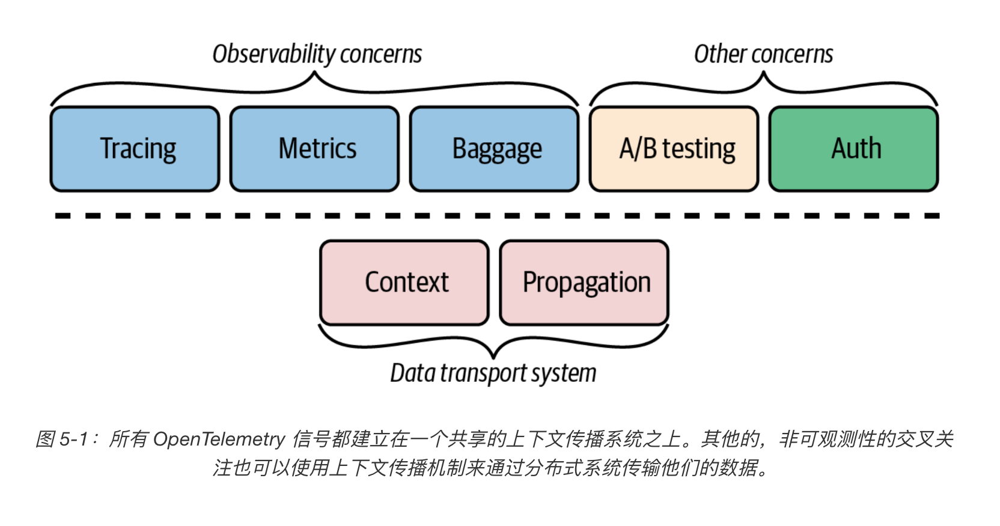
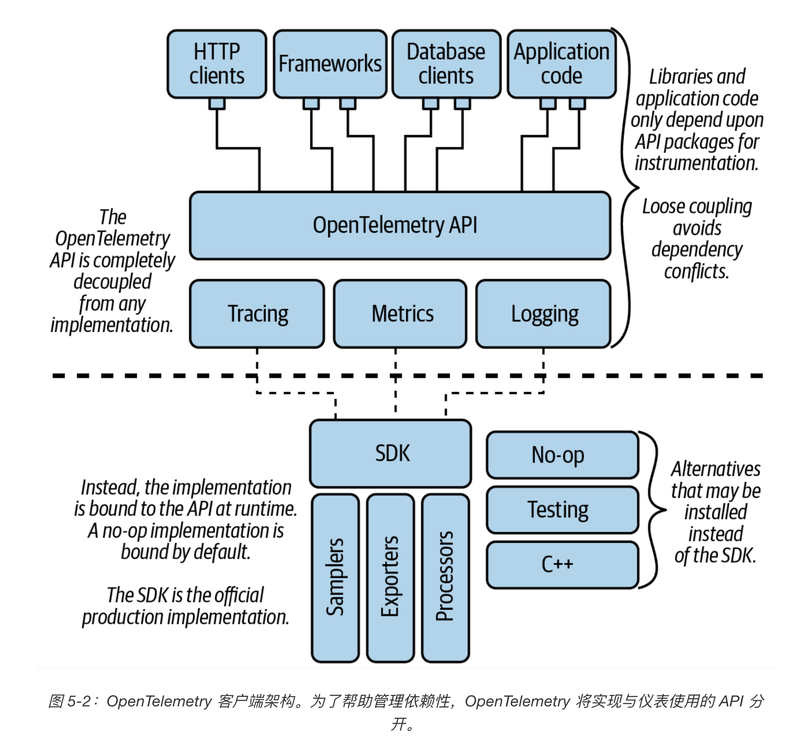
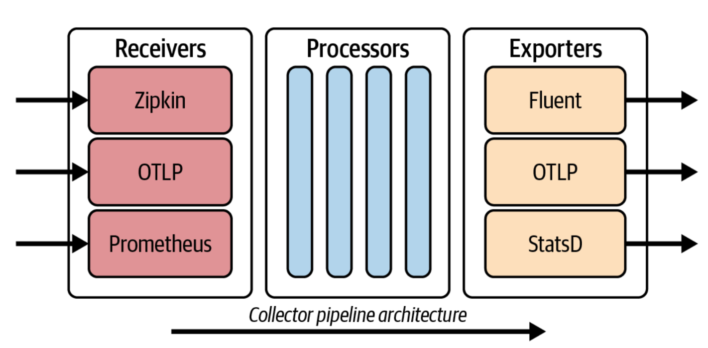

[toc]

# 信号，signal

OpenTelemetry 规范被组织成不同类型的遥测，我们称之为**信号（signal）**。

主要的信号是追踪tracing，其他还有日志log和度量metric。

信号作为横切关注点（cross-cutting concern），被整合到许多库中。

信号是OpenTelemetry中最基本的设计单位。

tracing、metrics、baggage 就是三种独立的信号。

信号共享通用的子系统——上下文传播。

OpenTelemetry 是一个**跨领域的关注点（cross-cutting concern）**，它在事务通过每个库和服务时追踪其执行。

所有 OpenTelemetry 信号都建立在一个共享的上下文传播系统之上。

# 上下文，context

上下文对象是一个与执行上下文相关联的键值存储。

信号在上下文对象中存储它们的数据。

# 传播器，Propagator

追踪上下文必须被参与事务的每个服务所共享，这样才能实现分布式。

在多进程的调用中，开启传播器用于跨服务传播 spanContext。

传播器通过`序列化`和`反序列化`上下文对象来实现这一点，允许信号在网络工作请求中追踪其事务。

传播器 API 定义了一个 `Propagator` 类型

- `TextMapPropagator` 将值注入载体并从载体中提取值为文本。

# Resources

`Resources` 获取关于被记录的遥测数据实体信息。

resource 附加于某个 process 产生的所有 trace 的键值对，在**初始化阶段**指定并传递到 collector中。

例如，Kubernetes 容器公开的度量可以链接到指定集群、名称空间、pod 和容器名称的资源。

`Resources` 可以捕获实体标识的整个层次结构，它可以描述云中的主机和特定的容器或进程中运行的应用程序。

# 追踪，tracing

OpenTelemetry 追踪系统是基于 OpenTracing 和 OpenCensus。

OpenTelemetry 追踪包括一个叫做**链接（link）**的概念，它允许单独的追踪被组合成一个更大的图。

# 指标，metric

指标包括追踪样本，自动将指标与产生它们的追踪样本联系起来。

# 日志，log

每当它出现的时候，日志就会自动附加到当前的追踪中。这使得事务日志很容易找到，并允许自动分析，以找到同一追踪中的日志之间的准确关联。

# Baggage

OpenTelemetry Baggage 是一个简单但通用的键值系统。

OpenTelemetry提供Baggage来传播键值对。

一旦数据被添加为 Baggage（包袱）它就可以被所有下游服务访问。

Baggage用于索引一个服务中的可观察事件，该服务包含同一事务中先前的服务提供的属性，有助于在事件之间建立因果关系。

可以将 Baggage 看做是一种**分布式文本的**形式。

Baggage 为添加在 metrics、log、traces 中的注解信息，键值对需要唯一，无法更改。

Baggage 是有代价的，因为每增加一个项目都必须被编码为一个头。

# 客户端架构

每个信号都包含四种类型的包：API，SDK，语义约定，贡献包(Contrib)

## API

**OpenTelemetry API** 是指用于编写仪表的一组组件。

该 API 被设计成可以直接嵌入到开放源码软件库以及应用程序中。

API包由用于检测的横切公共接口组成，导入到第三方库和应用程序代码的 OpenTelemetry 客户端的任何部分都被认为是 API 的一部分。

### 提供者，Provider

API 与任何实现完全分开。

提供者成为所有 API 调用的接收者。

当没有加载提供者时，API 默认为无操作提供者。

这使得 OpenTelemetry 仪表化可以安全地包含在共享库中。如果应用程序不使用 OpenTelemetry，API 调用就会变成 no-ops，不会产生任何开销。

## SDK

OpenTelemetry 项目为 OpenTelemetry API 提供了一个**官方实现**，我们称之为 OpenTelemetry SDK。

SDK是API的具体实现，这部分是语言相关的。

该 SDK 通过提供一个插件框架来实现 OpenTelemetry API。

在一个应用中，由应用程序所有者安装和管理sdk。

SDK包含额外的公共接口，部署于API包。这些公共接口被定义为构造器和插件。

- 构造器，Constructor：应用程序所有者用来初始化和配置OpenTelemetry SDK和贡献包的公共代码
- 插件，SDK Plugins：扩展OpenTelemetry SDK的库。插件接口如SpanProcessor，Exporter，Sampler等等

SDK 的插件架构被组织成一个流水线。

opentelemetry也是个插件式的架构，针对不同的开发语言会有相应的Client组件，叫**Instrumenttation**，也就是在代码中埋点调用的api/sdk采集telemetry数据。

追踪SDK

- 基本数据结构是一个无锁的 SpanData 对象。
- 当用户开始一个跨度时，SpanData 对象被创建，当用户添加属性和事件时，它被自动建立起来。
- 一旦一个跨度结束，SpanData 对象将不再被更新，可以安全地传递给后台线程。
- 流水线，该管道由一连串的 SpanProcessors 组成。
- 每个处理器对 SpanData 对象进行两次同步访问：一次是在跨度开始时，另一次是在跨度结束后。

### 采样器，sampler

OpenTelemetry 提供了几种常见的采样算法，包括前期采样和基于优先级的采样。

### 导出器，exporter

OpenTelemetry 为 OTLP（OpenTelemetry Protocol）、Jaeger、Zipkin、Prometheus 和 StatsD 提供导出器。

### 处理器，processor

## 语义约定（Semantic Conventions）

语义约定定义了键值，用于描述应用程序的可观察概念、协议和操作。

OpenTelemetry 项目保证所有的 instrumentation(不论任何语言)都包含相同的语义信息。

## 贡献包（Contrib Packages）

可选的、与 SDK 分离的插件和工具包被称为贡献包。

API Contrib 指的是仅依赖于 API 的包；SDK Contrib 指的是依赖 SDK 的包。

术语 Contrib 特指 OpenTelemetry 项目维护的插件和工具集合，不涉及第三方插件。

## 库仪表化

一般来说，必须检测的库包括 HTTP 客户端、HTTP 服务器、应用框架、消息传递 / 队列系统和数据库客户端。这些库经常在上下文传播中起作用。

- HTTP 客户端必须创建一个**客户端 span** 来记录请求。客户端还必须使用一个传播器，将当前的上下文作为一组 HTTP 头信息注入到请求中。
- HTTP 服务器（应用框架）必须使用一个传播器来从 HTTP 头信息中提取上下文。提取的上下文被用来创建一个**服务器跨度**，该跨度被设置为当前活动的跨度，它封装了所有的应用程序代码。
- 消息 / 队列系统中的发送者必须使用传播器将上下文注入消息中，这样就可以通过在接收者身上提取上下文来继续追踪。
- 数据库客户必须创建一个**数据库跨度**来记录数据基础事务。一旦数据库服务器也使用 OpenTelemetry 工具，数据库客户端也必须将上下文注入数据库请求中。

# 收集器，collector

收集器是一个灵活、可配置的遥测处理系统。

负责遥测数据源的接收、处理和导出三部分。

收集器管道可以提供以下服务：

- 配置，如路由和数据导出格式。
- 数据处理，如刷新、格式转换和向多个目的地发送。
- 缓冲，帮助管理网络。
- 机器级环境的资源检测。
- 收集主机指标，如 RAM、CPU 和存储容量。

收集器有两种主要的的操作模式

- 代理：与应用程序一起在本地运行的守护进程
- 收集器：独立运行的服务

## 接收器，receiver

收集器可以被配置为从各种来源接收各种格式的遥测数据。

一旦接收到，所有这些数据都会被转换为 OTLP。

OpenTelemetry 同时支持基于推和拉的接收器。

## 处理器，processor

一旦接收器将遥测数据转换为 OTLP，就会有各种处理器可用。处理器可以被配置为执行各种任务。

- 清洗数据以删除敏感数据，如 PII（个人身份信息）。
- 数据规范化
- 根据某些属性将数据路由到特定的后端
- 基于尾部的采样，以帮助确保错误和异常值更有可能被捕获，同时对嘈杂和无趣的信息进行速率限制

## 导出器，exporter

一旦遥测数据被处理，它可以被输出到各种后端。

除了将遥测数据转换为单一格式外，还可以安装多个导出器。

遥测数据可以按类型分开，并发送到不同的后端。

重复的遥测数据也可以被同步发送到多个后端。

## 管道，pipeline

收集器允许接收器、处理器和导出器组合成复杂的管道（pipeline），可以同时运行。

管道是通过 YAML 配置文件设计和管理的。