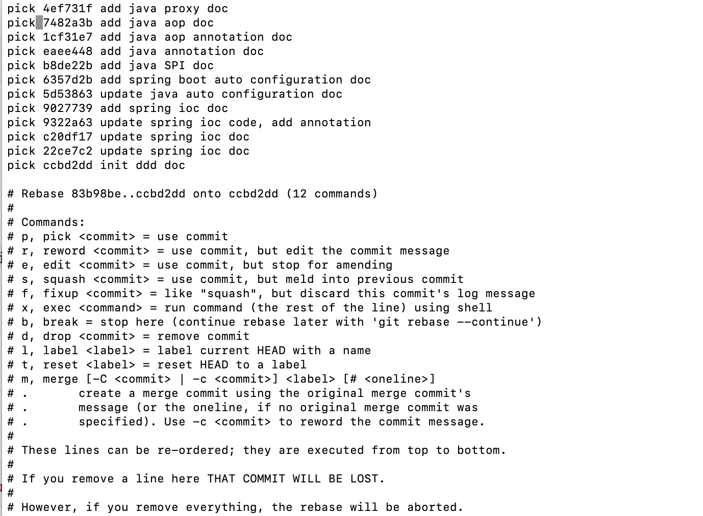
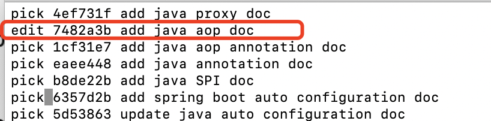
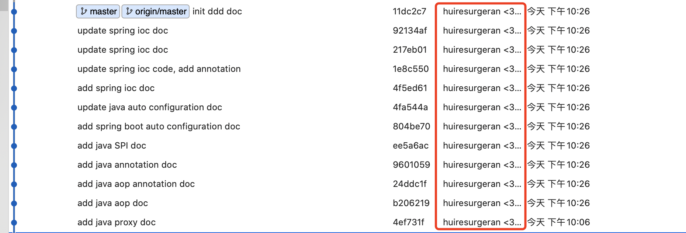

# 修改当前项目的用户

设置用户名

```shell
git config --local user.name "huiresurgeran"
```

设置用户邮箱

```shell
git config --local user.email "313829429@qq.com"           
```


# 查询之前的提交记录

N为最近的提交记录，1代表最近1次

```shell
git rebase -i HEAD~N
```

之后会显示所有的提交记录




每个记录都是`pick id xxx`

我们将需要修改的记录，`pick`改成`edit`，之后保存。




# 重置作者

git 提交 -- 修改 -- 作者 

```shell
git commit --amend --author="huiresurgeran <313829429@qq.com>" --no-edit
```

Git 重置 --继续

```shell
git rebase --continue
```


之后会一个一个文件进行确认，反复操作上两条命令即可


# 强制提交

```shell
git push --force  origin  master
```


# 成功修改



