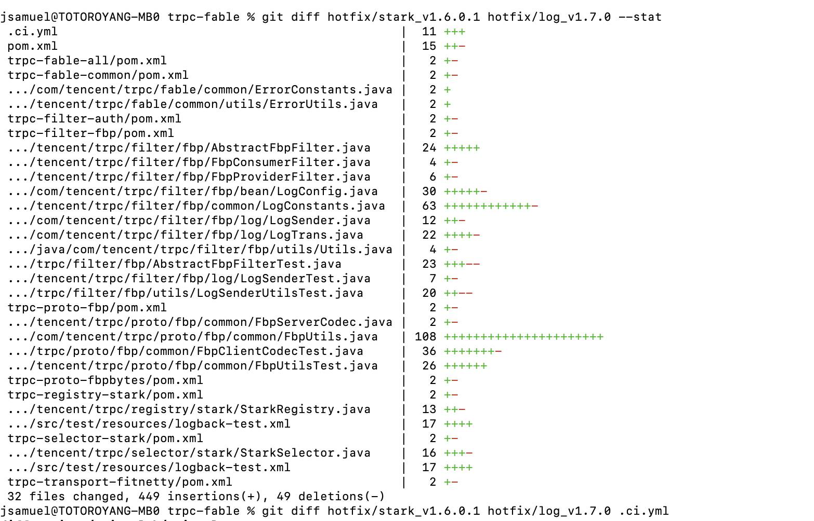
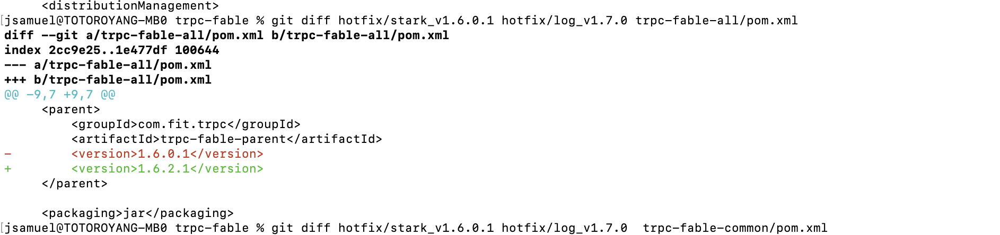

# 显示两个分支中差异的部分

`git diff hotfix/stark_v1.6.0.1 hotfix/log_v1.7.0 --stat`

# 显示指定文件的详细差异

 `git diff hotfix/stark_v1.6.0.1 hotfix/log_v1.7.0 .ci.yml`

# 参考文档

https://www.jianshu.com/p/bb97fabb475e