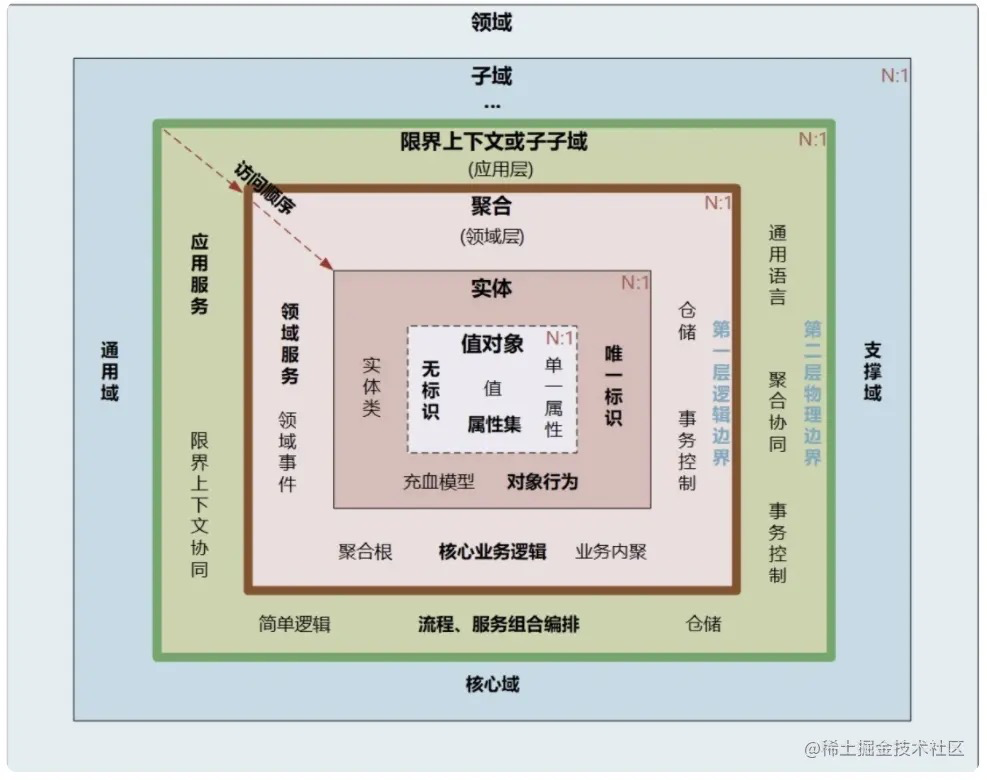

[toc]

DDD: Domain-Driven Design，领域驱动设计

# 常用术语

## 模型

失血模型：数据对象除了简单setter/getter方法没没有任何业务方法

充血模型：业务方法定义在实体对象中（DDD领域模型是充血模型）

## 领域和子域

领域：即边界，也包括规则和逻辑，在DDD中，领域就是这个边界内要解决的业务问题域

领域设计：在一定业务边界范围内进行的设计思想或活动，领域设计=边界 + 设计

子域：领域可以划分成子领域，划分出来的多个子领域，成为子域，每个子域对应一个更小的问题或者更小的业务范围

## 核心域、通用域、支撑域

子域可以根据重要程度和功能属性，划分为如下

- 核心域：决定产品和公司核心竞争力的子域，它是业务成功的主要因素和公司的核心竞争力。
- 通用域：没有太多个性化的诉求，同时被多个子域使用的通用功能的子域
- 支撑域：既不包含决定产品和公司核心竞争力的功能，也不包含通用功能的子域。

## 通用语言和限界上下文

通用语言：能够简单、清晰、准确描述业务涵义和规则的语言（落地场景，把领域对象，属性，代码模型对象等，通过代码和文字建立映射关系）

限界上下文：用来封装通用语言和领域对象，提供上下文环境，保证在领域之内的一些术语、业务相关对象等（通用语言）有一个确切的含义，没有二义性。限界，领域的边界。上下文，语义环境。

## 实体和值对象

实体：唯一身份标识 + 可变性（状态 + 行为），实体以DO（领域对象）的形式存在

值对象：将一个值用对象的方式进行表述，来表达一个具体的固定不变的概念，可以看做是不变对象，不需要身份标识

## 聚合和聚合根

聚合：把关联性极强，生命周期一致的实体、值对象放到一个聚合里。

- 聚合是领域对象的显示分组，支持领域模型的行为和不变型，同时充当一致性和事务性边界。
- 聚合有一个聚合根和上下文边界，边界根据业务单一职责和高内聚原则，定义了聚合内部应该包含哪些实体和值对象，聚合之间的边界是松耦合的，“高内聚、低耦合”
- 在DDD中属于领域层，领域层包含了多个聚合，共同实现核心业务逻辑。

- 跨多个实体的业务逻辑通过领域服务来实现
- 跨多个聚合的业务逻辑通过应用服务来实现。

聚合根：也称为根实体，它不仅是实体，还是聚合的管理者

- 作为实体本身，拥有实体的属性和业务行为，实现自身的业务逻辑
- 聚合的管理者，在聚合内部负责协调实体和值对象按照固定的业务规则，协同完成共同的业务逻辑
- 在聚合之间，他也是聚合对外的接口人，以聚合根 ID 关联的方式接受外部任务和请求，在上下文内实现聚合之间的业务协同。聚合之间通过聚合根 ID 关联引用，如果需要访问其它聚合的实体，就要先访问聚合根，再导航到聚合内部实体，外部对象不能直接访问聚合内实体。

## 领域服务和应用服务

领域服务：

- 当一些逻辑不属于某个实体时，可以把这些逻辑单独拿出来放到领域服务中，理想的情况是没有领域服务
- 可以使用领域服务的情况：
  - 执行一个显著的业务操作
  - 对领域对象进行转换
  - 以多个领域对象作为输入参数进行计算，结果产生一个值对象

应用服务：

- 应用层作为展现层与领域层的桥梁，是用来表达用例和用户故事的主要手段。
- 应用层通过应用服务接口来暴露系统的全部功能。
- 在应用服务的实现中，它负责编排和转发，它将要实现的功能委托给一个或多个领域对象来实现，它本身只负责处理业务用例的执行顺序以及结果的拼装。
- 隐藏了领域层的复杂性及其内部实现机制。
- 应该是较薄的一层，功能包括：定义应用服务，安全认证，权限校验，持久化事务控制，发生基于事件的消息通知，创建邮件以发送给客户

## 领域事件

领域事件 = 事件发布 + 事件存储 + 事件分发 + 事件处理。

领域事件是一个领域模型中极其重要的部分，用来表示领域中发生的事件。

- 事件发布：构建一个事件，需要唯一标识，然后发布；

- 事件存储：发布事件前需要存储，因为接收后的事建也会存储，可用于重试或对账等；

- 事件分发：服务内直接发布给订阅者，服务外需要借助消息中间件，比如Kafka，RabbitMQ等；

- 事件处理：先将事件存储，然后再处理。

## 资源库（仓储）

聚合的管理，仓储介于领域模型和数据模型之间，用于聚合的持久化和检索。

他隔离了领域模型和数据模型，方便关注于领域模型而不需要考虑如何进行持久化。

## 其他

CQRS：命令查询责任分离”（Command Query Responsibility Segregation）

PO：简单无规则java对象，plain ordinary java object，

VO：视图对象，View Object，用于展示层，展示某个页面/组件用的数据

DTO：数据传输对象，Data Transfer Object，展示层与服务层之间的数据传输对象，通常指的前后端之间的传输

DO：领域对象，Domain Object，从现实世界中抽象出来的有形或者无形的业务实体，等同于BO

PO：持久对象，Persistant Object，跟持久层的数据结构形成一对一的映射关系，简单来说就是数据库中的记录

Entity：等同于PO

BO：业务对象，Business Object，BO是PO的组合

- 一类业务对应一个BO，数量上没有限制
- BO有很多业务操作，除了get/set之外，有很多针对自身数据计算的方法

VO和DTO的区别

- DTO代表服务层需要接收的数据和返回的数据
- VO代表展示层需要显示的数据
- 字段不一样，VO会根据需要，删减一些字段
- 值不一样，VO会根据需要，对DTO中的值进行展示业务的解释

DO和DTO的区别

- DTO是展示层和服务层之间的数据传输对象（可以认为是两者之间的协议），在DO的基础上，只需要自己需要的数据，会进行数据的裁剪
- DO是对现实世界各种业务角色的抽象，不是简单的POJO，具有领域业务逻辑

DO和PO的区别

- DO和PO在绝大部分情况下是一一对应的
- DO在某些场景下不需要进行显式的持久化，那么这类DO是不存在对应的PO的
- 某些场景下，PO也没有对应的DO
- 为了某种持久化策略或者性能的考虑，一个PO可能对应多个DO

BO和DTO的区别

- BO对内，为了进行业务计算需要辅助数据，或者是一个业务有多个对外的接口，BO可能会含有很多接口对外所不需要的数据
- DTO需要在BO的基础上，只要自己需要的数据，然后对外提供，不会有数据内容的变化

数据库 => PO/Entity => BO/DO => user interface => DTO => (VO) => web 页面

有界上下文：用户 + 领域模型 + 功能

# 分层结构

严格分层：某层只能与直接下层发生耦合

松散分层：允许上层与任意下层发生耦合

用户交互层：controller层，无业务逻辑

- web请求，rpc请求，mq消息等外部输入，都被视为外部输入的请求，可以修改到内部的业务数据

应用服务层

- 此层可以包含查询逻辑，但核心业务逻辑必须下沉到领域层

- 负责编排，转发，校验

领域服务层：系统的核心，负责表达业务概念，业务状态信息，业务规则

- 包含了所有复杂的业务知识抽象和规则定义，业务在这里组装
- 重点放在领域对象分析上（实体，值对象，聚合，领域服务，领域事件，仓储，工厂等）
- 仓储（资源库）接口在此层定义

基础设置层：仓储（资源库）实现层 + PO持久化层

- 为领域模型提供持久化机制
- 对其他层提供通用的技术支持能力，如消息通信，通用工具，配置等

通常是松散结构

- 简单查询不涉及业务，可以从Application直接穿透到Infrastructure的PO查询，不需要经过domain。

- DDD不限制非业务类操作跨层调用。

  - 每层都可能使用它下面所有层的服务，而不仅仅是下一层的服务

  - 每层都可能是半透明的，有些服务只对上一层可见，而有些服务对上面的所有层都可见

- DTO不能存在于domain层，DDD认为DTO不是业务对象，entity才是。

# demo示例

# 参考文档

https://juejin.cn/post/7024640082082529317