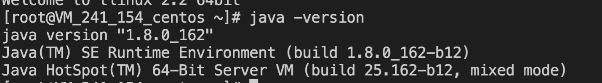

[toc]

# 基本概念

## JDK和JRE

JRE：Java Runtime Environment，仅包含Java程序的必须组件，包括Java虚拟机以及Java核心类库等

JDK：Java Development Kit，除了包含JRE外，还附带一系列开发、诊断工具


## JDK与J2SE

JDK：Java Development Kit，除了包含JRE外，还附带一系列开发、诊断工具

J2SE：Java三大技术体系的一个，JDK1.2发布时，Java技术体系被拆分为J2SE，J2EE，J2ME三大体系

- J2SE，标准版技术体系，Java 2 Standard Edition，包含构成Java语言核心的类，包括数据库连接，网络编程，接口定义等，主要用于桌面应用软件的编程
- J2EE，企业版技术体系，Java 2 Enterprise Edition，除了包含J2SE中的类，还包含用于开发企业级应用的类，包括Servlet，JSP，EJB等，主要用于分布式的网络程序的开发，比如电子商务网站等
- J2ME，嵌入式技术体系，Java 2 Micro Edition，包含J2SE中的一部分类，主要用于消费类电子产品的软件开发，如手机等


## J2SE与Java SE

其实他们两指的是一个东西。

只不过在2006年JDK1.6发布时，将J2SE，J2EE，J2ME的命名方式，改为了Java SE 6，Java EE 6，Java ME 6。


# 虚拟机历史

目前使用最广泛的默认虚拟机： Sun HotSpot VM


# 虚拟机的概念

和其他语言不同，Java语言并不直接将代码编译成与系统有关的机器码，而是编译成一种特定的语言规范，这种语言规范我们称之为字节码。

Java虚拟机会解析字节码文件的内容，并将其翻译成为各个操作系统可以理解的机器码。Java虚拟机运行的是字节码文件，与字节码文件（Class文件）绑定。

所以其实`Java虚拟机，就是一个字节码翻译器`，它将字节码文件，翻译成各个系统对应的机器码，确保字节码文件能够在各个操作系统正确运行。


# 源代码如何变成机器码

编译器可以分成：前端编译器，JIT编译器，AOT编译器


## 前端编译器（源代码 => 字节码）

JDK的安装目录中，有一个`javac`工具，用于将Java代码翻译成字节码，这个工具我们叫做`编译器`，相对于后面要说的其他编译器，因为处于编译的前期，所以又被称为`前端编译器`。


javac编译器的处理过程

- 词法，语法分析：java编译器对源代码的字符进行扫描，生成一个抽象的语法树
- 填充符号表：对抽象的类或者接口进行符号填充，等到类加载阶段，javac编译器会将符号替换成具体的内存地址，用于解决类之间的相互引用
- 注解处理：对注解进行分析，根据注解的作用，将其还原成具体的指令集
- 分析与字节码生成：输出class文件


常见的前端编译器：Sun的javac，Eclipse JDT的增量式编译器（ECJ）


## JIT编译器（字节码 => 机器码）

JIT：Just-In-Time，即时编译器


### 解释执行&编译执行

解释执行与编译执行，是计算机编程语言的两种执行方式。

- 解释：将源代码逐行转换为机器码并运行的过程（机器码并没有保存下来）
- 编译：将源代码一次性转换为机器码的过程（机器码有保存为文件，下次运行的时候直接运行机器码）
- 解释执行（解释器）：在执行程序时，将中间码（如Java的字节码通过JVM解释成机器码）一行行的解释成机器码进行执行，这个运行过程是解释一行，执行一行
- 编译执行（编译器）：将一段程序直接翻译成机器码（C/C++）或者中间码（Java）。编译执行是将所有语句都编译成了机器语言，并且保存成可执行的机器码，执行的时候，是直接执行机器语言，不需要再进行解释/编译


### 运行程序方式（字节码）

源代码转化为字节码后，要运行程序，有两种方式

- 使用Java解释器，解释执行字节码；启动速度快，运行速度慢
- 使用JIT编译器，将字节码转化为本地机器代码；启动速度慢，运行速度快

为了运行速度和效率，我们通常采用两者结合的方式进行Java代码的编译执行。


### 编译模式

在HotSpot虚拟机内置了两个即时编译器，Client Compiler和Server Compiler。

这两个编译器衍生出两种不同的编译模式，分别为：C1编译模式，C2编译模式。

- C1编译模式：将字节码编译为本地代码，进行简单、可靠的优化，并且可以加入性能监控的逻辑；编译速度较快，优化较保守；Client Compiler
- C2编译模式：将字节码编译为本地代码，启用一些编译耗时较长的优化，根据性能监控信息进行一些不可靠的激进优化；编译速度慢，编译质量相对较好；Server Compiler


### 运行模式

对于HotSpot虚拟机来说，有三中运行模式可选

- 混合模式，Mixed Mode：C1和C2两种模式混合使用，默认的运行方式，若想单独使用C1或者C2，可以使用`-client`或者`-server`打开
- 解释模式，Interpreted Mode：所有代码都解释执行，使用`-Xint`参数可以打开这个模式
- 编译模式，Compiled Mode：优先采用编译，无法编译时也会解释执行，使用`-Xcomp`打开这种模式


如下图，使用的是Mixed Mode运行模式




## AOT编译器（源代码 => 机器码)

基本思想：在程序执行前生成Java方法的本地代码，方便程序运行时直接使用本地代码。


问题：Java语言具有动态特性，不如动态类加载。因为AOT在程序运行前编译，无法获知动态信息，会出现一系列问题。


缺点：编译质量比不上JIT编译器

优点：避免JIT编译器的运行时性能消耗或内存消耗，避免解释程序的早期性能开销


## 总结

编译速度：解释执行 > AOT编译器  > JIT编译器

编译质量：JIT编译器 > AOT编译器 > 解释执行

在JVM中，通过这几种不同方式的配合，使得JVM的编译质量和运行速度达到最优状态。


# 字节码文件结构

https://www.cnblogs.com/chanshuyi/p/jvm_serial_05_jvm_bytecode_analysis.html


# Java虚拟机内存结构

在生成好字节码文件后，Java虚拟机会加载字节码文件，将其存入Java虚拟机的内存空间中，并进行初始化。

Java虚拟机的内存结构分为公有 + 私有。


## 公有部分：Java堆，方法区，常量池

在Java虚拟机中，线程共享部分包括Java堆，方法区，常量池。

 ### Java堆

从JVM划分出一块区域，专门用于Java实例对象的内存分配，几乎所有实例对象都会在这里进行内存的分配。

Java堆根据对象存活时间的不同，被分为年轻代，老年代两个区域，年轻代被进一步分为Eden区，From Survivor 0，To Survivor 1区


- 年轻代：

  - Eden区：
    - 对象需要分配时，对象优先被分配在Eden区，Eden区域内存不够时，Java虚拟机会启动垃圾回收，此时Eden区中没有被引用的对象的内存就会被回收，一些存活时间较长的对象会进入到老年代
    - `-XX:MaxTenuringThreshold`参数：用于设置晋升到老年代需要经历的GC次数

  - From Survivor 0：

  - To Survivor 1

- 老年代：


区域划分的作用：防止频繁的垃圾回收，提高垃圾回收效率。

- 区域内存不足，会触发垃圾回收，存活时间短的对象的不断加入，会导致频繁的垃圾回收
- 垃圾回收时需要对内存进行扫描，存活时间长的对象，扫描只会浪费时间


默认虚拟机配置，Eden：from ：to = 8:1:1 

原因：IBM公司根据统计结果发现，80%的对象，存活时间都很短，这样设置可以减少内存空间的浪费，提高内存空间利用率


### 方法区

存储Java类字节码数据的一块区域，存储了每一个类的结构信息，如运行时常量池，字段，方法数据，构造方法等等。

方法区在不同版本的虚拟机中有不同而表现形式

- JDK 1.7中，方法区被称为永久代，Permanent Space
- JDK 1.8中，方法区被称为MetaSpace


## 私有部分：每个线程的私有数据

线程私有部分：PC寄存器，Java虚拟机栈，本地方法栈


### PC寄存器

Program Counter寄存器，保存线程当前正在执行的方法。

如果方法不是native，那么PC寄存器保存Java虚拟机正在执行的字节码指令地址。

如果方法是native，那么PC寄存器保存的值是undefined。

任意时刻，一条Java虚拟机线程，只会执行一个方法的代码，而这个被线程执行的方法，被称为该线程的当前方法，他的地址被存在PC寄存器中。


native方法：java调用非java代码的接口。

native方法称为本地方法。 在java源程序中以关键字“native”声明，不提供函数体。 其实现使用C/C++语言在另外的文件中编写，编写的规则遵循Java本地接口的规范(简称JNI)。 简而言就是Java中声明的可调用的使用C/C++实现的方法。


### Java虚拟机栈

栈与线程同时创建，用于存储栈帧，即存储局部变量与一些过程结果。

栈帧存储的数据包括：局部变量表，操作数栈。


### 本地方法栈

Java 虚拟机使用其他语言（例如 C 语言）来实现指令集解释器时，也会使用到本地方法栈。

如果 Java 虚拟机不支持 natvie 方法，并且自己也不依赖传统栈的话，可以无需支持本地方法栈。


# JVM类加载机制

当编译器将Java源码编译为字节码之后，虚拟机可以将字节码读取进内存，进行解析、运行等整个过程。

这个过程我们叫做`Java虚拟机的类加载机制`。

JVM虚拟机执行class字节码的过程分为7个阶段：加载，验证，准备，解析，初始化，使用，卸载。


## 加载

加载阶段，是类加载过程的第一个阶段，将代码数据加载到内存中。

- 将字节码从各个位置（包括网络、磁盘等等）转化为二进制字节流加载到内存中
- 之后会为这个类在JVM的方法区创建一个对应的Class对象，这个Class对象就是这个类各种数据的访问入口


## 验证

JVM对字节码流进行校验，只有符合JVM字节码规范的文件，才能被JVM正确执行

校验过程：

- JVM规范校验：文件格式校验，判断是否符合JVM规范，能否被当前版本的虚拟机处理
- 代码逻辑校验：对代码组成的数据流和控制流进行校验，确保JVM运行该字节码文件后，不会出现致命错误，比如错误的参数类型，缺少的类等等


## 准备（重要）

JVM开始为类变量分配内存并且初始化。

关键点：

- 内存分配的对象
  - Java中的变量有，类变量 + 类成员变量
    - 类变量：被static修饰的变量
    - 类成员变量：其他所有类型的变量
  - 准备阶段，JVM只会为`类变量`分配内存，不会为`类成员变量`分配内存，`类成员变量`的内存分配需要等到初始化阶段才开始
- 初始化的类型：
  - 这里的初始化，指的是为变量赋予Java语言中该数据类型的`零`值，而不是用户代码里初始化的值：`public static int sector = 3;`，赋值为0
  - 如果一个变量是常量，即被`static final`修饰，那么在准备阶段，属性会被赋予成用户希望的值：`public static final int number = 3;`，赋值为3


## 解析

当通过准备阶段之后，JVM 针对类或接口、字段、类方法、接口方法、方法类型、方法句柄和调用点限定符 7 类引用进行解析。

这个阶段的主要任务是将其在常量池中的符号引用替换成直接在内存中的直接引用。


## 初始化（重要）

初始化阶段，用户定义的Java程序代码，才真正开始执行。

这个阶段，JVM会根据语句执行顺序，对类对象进行初始化。

一般JVM遇到以下5种情况时会触发初始化：

- 碰到new，getstatic，putstatic，inbokestatic这四条字节码指令时，如果类没有进行过初始化，需要先触发初始化。常见Java代码场景：使用new关键字实例化对象，读取或设置一个类的静态字段，调用一个类的静态方法
- 使用java.lang.reflect包的方法，对类进行反射调用时，如果类没有进行过初始化，需要先触发初始化；反射，在运行时才知道要操作的具体类是什么
- 初始化一个类时，如果其父类还没有进行过初始化，需要先触发其父类的初始化
- 虚拟机启动时，用户需要指定一个要执行的主类（包含main()方法的类），虚拟机会先初始化这个主类
- 使用JDK1.7动态语言支持时，如果一个 java.lang.invoke.MethodHandle实例最后的解析结果 REF_getstatic,REF_putstatic,REF_invokeStatic 的方法句柄，并且这个方法句柄所对应的类没有进行初始化，则需要先出触发其初始化


## 使用

JVM完成初始化之后，JVM就可以从入口方法开始执行用户的程序代码


## 卸载

用户程序代码执行完毕后，JVM可以开始销毁创建的Class对象，最后负责运行的JVM也退出内存。


## 类的初始化顺序


- 类初始化方法：编译器会按照出现的顺序，收集类变量的赋值语句，静态代码块，组中组成类初始化方法。类初始化方法一般在`类初始化`的时候执行。
- 对象初始化方法：编译器会按照出现的顺序，手机成员变量的赋值语句，普通代码块，最后收集构造函数的代码，最终组成对象初始化方法。对象初始化方法一般在`实例化类对象`的时候执行


实例代码

```java
public class Book {
    private static final Logger logger = LoggerFactory.getLogger(Book.class);

    public static void main(String[] args) {
        logger.info("Hello Book");
        Book book = new Book();
    }

    Book(){
        logger.info("book constructor");
        logger.info("price {}, amount {}", price, amount);
    }

    {
        logger.info("book code block");
    }

    int price = 10;

    static {
        logger.info("book static code");
    }

    static int amount = 112;
}
```


日志输出

```
02:08:32.446 [main] INFO com.jsamuel.study.jvm.bean.Book - book static code
02:08:32.448 [main] INFO com.jsamuel.study.jvm.bean.Book - Hello Book
02:08:32.448 [main] INFO com.jsamuel.study.jvm.bean.Book - book code block
02:08:32.448 [main] INFO com.jsamuel.study.jvm.bean.Book - book constructor
02:08:32.448 [main] INFO com.jsamuel.study.jvm.bean.Book - price 10, amount 112
```


说明类的初始化顺序是

- 类初始化方法 -> 对象初始化方法
- 类初始化方法：赋值语句&静态代码块(准备) -> 静态方法main(初始化)，按出现顺序收集
- 对象初始化方法：成员变量的赋值语句 &普通代码块 -> 构造函数代码，按出现顺序收集


分析一个类的执行顺序的方法论

- 确定类变量的初始值
  - 类加载的准备阶段，JVM会为类变量(static)初始化0值，这时类变量会有一个初始的0值
  - 被final修饰的类变量，直接会被初始成用户想要的值
- 初始化入口方法
  - 进入类加载的初始化阶段，JVM会寻找整个main方法入口，初始化main方法所在的类
  - 当需要对一个类进行初始化时，首先初始化类构造器（static修饰部分），再初始化对象构造器（普通代码块，构造函数等），只有new了对象时，即进行对象的实例化时，才需要初始化对象构造器
  - 初始化完main方法所在的类，再执行main方法中的代码
- 初始化类构造器
  - JVM按顺序，收集类变量的赋值语句，静态代码块，组成类构造器
- 初始化对象构造器
  - JVM按顺序，收集成员变量的赋值语句，普通代码块，最后是收集构造方法，组成对象构造器
- 如果初始化main方法所在类时，遇到了其他类的初始化，那么久先加载对应的类，加载完成之后返回，如此反复循环，最终回到main方法所在类，回到main方法函数体


# JVM垃圾回收机制


## 什么是垃圾

如果一个对象不可能再被引用，那么这个对象就是垃圾，应该要被回收。

Java虚拟机判断垃圾对象，使用的是GC Root Tracing算法：从 GC Root 出发，所有可达的对象都是存活的对象，而所有不可达的对象都是垃圾。

GC Root是一组活跃引用的集合，经过特意筛选出来的，通常包括

- 所有当前被加载的Java类
- Java类的引用类型静态变量
- Java类的运行时常量池里的引用类型常量
- VM的一些静态数据结构里指向GC堆里的对象的引用
- ...


## 如何进行垃圾回收

有三种算法：标记清除算法，复制算法，标记压缩算法


### 标记清除算法

分为两个阶段，标记阶段，清除阶段

- 在标记阶段，标记所有由GC Root触发的可达对象，此时所有未被标记的对象就是垃圾对象
- 在清除阶段，清除所有未被标记的对象


优点：不需要移动太多对象，比较适合在存活对象比较多的情况

缺点：空间碎片问题，空间碎片过多，会导致内存空间的不连续，对于大对象的分配和使用，会降低效率


### 复制算法

核心思想是：将原有的内存空间分为两块，每次只使用一块

- 在垃圾回收时，将正在使用的内存中的存活对象复制到未使用的内存块中
- 清除正在使用的内存块中的所有对象
- 交互两个内存块的角色
- 这样就完成了垃圾回收


优点：清理后不会有空间碎片，比较适合存活对象比较少的情况

缺点：内存空间折半，浪费内存空间


### 标记压缩算法

标记清除算法的优化版，包括两个阶段

- 标记结算：从 GC Root 引用集合触发去标记所有对象
- 压缩阶段：将所有存活的对象压缩在内存的一边，之后清理边界外的所有空间


优点：减少了空间碎片


## 分代算法

分代思想按照对象的生命周期长短将其分为了两个部分（新生代、老年代）。


根据 JVM 内存的不同内存区域，采用不同的垃圾回收算法。

存活对象少的新生代区域，适合采用复制算法。

存活对象多的老年代区域，适合采用标记压缩算法/标记清除算法。


新生代：

- 复制算法
- 回收时，将Eden和Survivor中还存活的对象，一次性复制到另外一块Survivor空间上，然后清理掉Eden和刚才用过的Eden空间
- 比例分配：`e:f:t => 8:1:1`
- 因为大部分对象都是朝生夕死，所以不需要按照1:1的比例划分空间


## 分区思想

将整个堆空间划分成连续的不同小区间。

每一个小区间都独立使用，独立回收。

优点：可以控制一次回收多少个区间，较好地控制 GC 时间。


# 垃圾回收器

Java虚拟机的垃圾回收器，分为四大类：串行回收器，并行回收器，CMS回收器，G1回收器。


## 串行回收器

串行回收器是指使用单线程进行垃圾回收的回收器。

每次回收时只有一个线程，因此串行回收器在并发能力较弱的计算机上，其专注性和独占性的特点往往能让其有更好的性能表现。

串行回收器可以在新生代和老年代使用，根据作用于不同的堆空间，分为新生代串行回收器和老年代串行回收器。


### 新生代串行回收器

算法：在新生代串行回收器中使用的是`复制算法`。

缺点：在串行回收器进行垃圾回收时，会触发 Stop-The-World 现象，即其他线程都需要**暂停**，等待垃圾回收完成。因此在某些情况下，其会造成较为糟糕的用户体验。

启用参数：使用 `-XX:+UseSerialGC` 参数可以指定使用新生代串行收集器和老年代串行收集器。当虚拟机在 Client 模式下运行时，其默认使用该垃圾收集器。


### 老年代串行回收器

算法：在老年代串行回收器中使用的是标记压缩算法。

缺点：垃圾回收时，只能串行、独占式地进行垃圾回收，因此也经常会有较长时间的 Stop-The-World 发生。

优点：老年代串行回收器的好处之一，就是其可以与多种新生代回收器配合使用。

启用参数：

- `-XX:UseSerialGC`：新生代，老年代，都是用串行回收器
- `-XX:UseParNewGC`：新生代使用ParNew回收器，老年代使用串行回收器
- `-XX:UseParallelGC`：新生代使用ParallelGC回收器，老年代使用串行回收器


## 并行回收器

并行回收器在串行回收器基础上做了改进，使用多线程进行垃圾回收。

根据作用内存区域的不同，并行回收器也有三个不同的回收器：新生代ParNew回收器，新生代ParallelGC回收器，老年代ParallelGC回收器。


### 新生代ParNew回收器

工作在新生代，简单地将串行回收器多线程化，回收策略、算法、参数，和新生代串行回收器一样。


算法：复制算法

使用多线程进行垃圾回收，垃圾收集过程中会触发 Stop-The-World 现象：

- 在并发能力强的 CPU 上：其产生的停顿时间要短于串行回收器
- 在单 CPU 或并发能力弱的系统中：并行回收器效果会因为线程切换的原因，表现反而不如串行回收器


启用参数：

- `-XX:+UseParNewGC`：新生代使用 ParNew 回收器，老年代使用串行回收器
- `-XX:UseConcMarkSweepGC`：新生代使用 ParNew 回收器，老年代使用 CMS
- `-XX:ParallelGCThreads`：指定 ParNew 回收器的工作线程数量


### 新生代Paraller GC 回收器

与新生代ParNew回收器非常类似。

- 算法：复制算法

- 多线程，独占式的收集器

- 导致 Stop-The-World 现象


不同点：非常注重系统的吞吐量。

有一个自适应GC调节策略，可以使用 `-XX:+UseAdaptiveSizePolicy` 参数打开这个策略，在这个模式下，新生代的大小、Eden 和 Survivor 的比例、晋升老年代的对象年龄等参数都会被自动调节，达到堆大小、吞吐量、停顿时间的平衡点。

Parallel GC 回收器提供了两个重要参数用于控制系统的吞吐量

- `-XX:MaxGCPauseMillis`：设置最大垃圾收集停顿时间。
- `-XX:GCTimeRatio`：设置吞吐量大小，一个 0 - 100 的整数。假设 GCTimeRatio 的值为 n，那么系统将不花费超过 1/(1+n) 的时间用于垃圾收集。


新生代 Parallel GC 回收器可以使用以下参数启用：

- `-XX:+UseParallelGC`：新生代使用 ParallelGC 回收器，老年代使用串行回收器。
- `-XX:+UseParallelOldGC`：新生代使用 ParallelGC 回收器，老年代使用 ParallelOldGC 回收器。


### 老年代ParallelOldGC回收器

也是一种多线程并发的回收器。

与新生代ParallelGC收集器一样，也是注重吞吐量的收集器，只不过是作用于老年代。


算法：ParallelOldGC 回收器使用的是标记压缩算法。


参数：

- 使用`-XX:UseParallelOldGC`参数在新生代中使用 ParallelGC 收集器，在老年代中使用 ParallelOldGC 收集器
- `-XX:ParallelGCThreads`也可以用于设置垃圾回收时的线程数量


## CMS回收器

与 ParallelGC 和 ParallelOldGC 不同，CMS 回收器主要关注系统停顿时间。

CMS 回收器， Concurrent Mark Sweep，标记清除算法，是一个使用多线程并行回收的垃圾回收器。


### 工作步骤

初始标记：独占系统资源

并发标记：可以和用户线程一起执行

预清理：可以和用户线程一起执行

重新标记：独占系统资源

并发清除：可以和用户线程一起执行

并发充值：可以和用户线程一起执行


默认会有预清理的操作，我们可以关闭开关 `-XX:-CMSPrecleaningEnabled` 不进行预清理。

因为重新标记是独占 CPU 的，因此如果新生代 GC 发生之后，立刻触发一次新生代 GC，那么停顿时间就会很长。


### 主要参数

启动 CMS 回收器：`-XX:+UseConcMarkSweepGC`

线程并发数量：`-XX:ConcGCThreads`，`-XX:ParallelCMSThreads`

指定老年代空间使用阈值：`-XX:CMSInitiatingOccupancyFraction`，老年代空间使用率达到阈值时，会执行一次CMS回收，不像其他回收器，等到内存不够用的时候才GC

内存碎片整理： `XX:+UseCMSCompactAtFullCollection` ，让 CMS 在完成垃圾回收后，进行一次内存碎片整理

内存压缩：`-XX:CMSFullGCsBeforeCompaction` 参数设置进行多少次 CMS 回收后，进行一次内存压缩

CMS回收Perm区：打开`XX:+CMSClassUnloadingEnabled` 开关


缺点： CMS 回收器会产生较多内存碎片。


## G1回收器

G1回收器是JDK1.7中使用的全新垃圾回收器，长远来看，可以取代CMS回收器。

G1回收器拥有独特的垃圾回收策略。


分代来看，G1属于分代垃圾回收器，但是他使用了分区算法，使得Eden区，From区，Survivor区和老年代等各种内存不必连续。


G1回收器之前，所有的垃圾回收器的内存分配都是连续的一块内存。


G1回收器之后，将其一大块的内存分为许多细小的区块，所以不要求内存是连续的。

每一块都是一个Region。


H：Humongous，表示这些 Region 存储的是巨型对象（humongous object，H-obj）。当新建对象大小超过 Region 大小一半时，直接在新的一个或多个连续 Region 中分配，并标记为 H。


堆内存中一个 Region 的大小可以通过 `-XX:G1HeapRegionSize` 参数指定。大小区间只能是1M、2M、4M、8M、16M 和 32M，总之是2的幂次方。如果G1HeapRegionSize 为默认值，即把设置的最小堆内存按照2048份均分，最后得到一个合理的大小。


### 工作步骤

G1收集器有四个阶段

- 新生代GC
  - 新生代 GC 与其他垃圾收集器的类似，就是清空 Eden 区，将存活对象移动到 Survivor 区，部分年龄到了就移动到老年代。
- 并发标记周期
  - 分为：初始标记、根区域扫描、并发标记、重新标记、独占清理、并发清理阶段。
  - 初始标记、重新标记、独占清理是独占式的，会引起停顿。
  - 初始标记会引发一次新生代 GC。
  - 所有将要被回收的区域会被 G1 记录在一个称之为 Collection Set 的集合中。
- 混合收集
  - 首先针对 Collection Set 中的内存进行回收，因为这些垃圾比例较高。
  - G1 回收器的名字 Garbage First 就是这个意思，垃圾优先处理的意思。
  - 在混合回收的时候，也会执行多次新生代 GC 和 混合 GC，从而来进行内存的回收
- 如果需要，进行FullGC
  - 当在回收阶段遇到内存不足时，G1 会停止垃圾回收并进行一次 Full GC，从而腾出更多空间进行垃圾回收


### 相关参数

打开G1回收器：`-XX:+UseG1GC`

设置目标最大停顿时间：`-XX:MaxGCPauseMillis`

设置GC工作线程数量：`-XX:ParallelGCThreads`

设置堆使用率触发并发标记周期的执行：`-XX:InitiatingHeapOccupancyPercent`。


