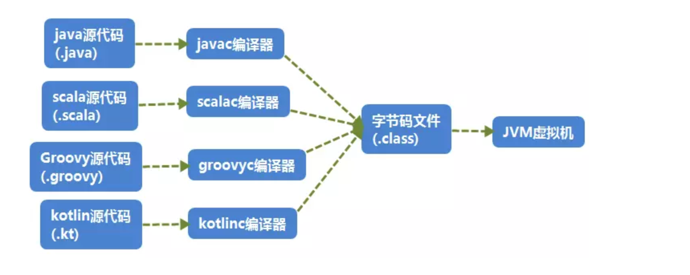

[toc]

源代码通过编译器，编译为字节码，再通过类加载子系统进行加载到JVM中运行。

# Java字节码文件

class文件本质上是一个以8位字节为基础单位的二进制流，各个数据项目严格按照顺序紧凑的排列在class文件中。jvm根据其特定的规则解析该二进制数据，从而得到相关信息。

Class文件采用一种伪结构来存储数据，它有两种类型：无符号数和表。

## Class文件的结构属性

### 魔数与class文件的版本

每个class文件的头4个字节成为魔数，值为0xCAFEBABE。

作用是确定这个文件是一个class文件。

### 常量池

class文件的资源仓库，是class文件结构中关联最多的数据类型，也是占用class文件最大的数据项目之一。

常量池存储的资源有：变量的属性，类型和名称；方法的属性，类型和名称等等。

### 访问标志

表示该class为属性和访问类型。

比如该class是类还是接口，他的访问类型是否为public，类型是否被标记为final。

### 类索引，父类索引，接口索引

类索引，父类索引和接口索引，简单的理解为一种描述的数据项目。

class文件靠类索引，父类索引和接口索引这三项数据来确定这个类的继承关系。

### 字段表属性

用于描述接口或类中生命的变量。

比如变量的作用域（public，private，protected）

是否是静态变量（static）

可变性（final）

数据类型（基本类型，数组，对象）等等

### 方法表属性

与字段表类似，不过方法表属性描述的是方法的类型、作用域等等。

### 属性表属性

用于描述某些场景的专有的信息。

比如字段表中特殊的属性，方法表中特殊的属性等等。

# 类文件结构

## 常量池

## 访问标志

## 类和接口索引

## 字段表属性

## 方法表属性

## 属性表属性

# 理解字节码

## javac & javap

## 其他语言，比如Kotlin

