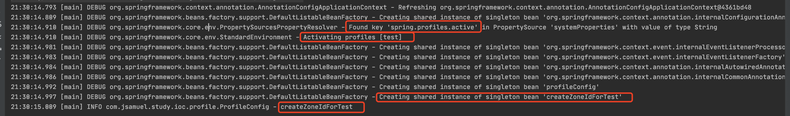

[toc]

# 容器的概念

容器：为某种特定组件的运行提供必要支持的一个软件环境，同时还提供了许多底层服务

如：

- Tomcat是一个Servlet容器
- Docker是一个容器，提供了必要的Linux环境


Spring的核心，就是提供了一个IoC容器，可以管理所有轻量级的JavaBean组件，提供的底层服务包括组件的生命周期管理，配置和组装服务，AOP支持，以及建立在AOP基础上的声明式事务服务等。


# IoC原理

Spring提供的容器，又称为IoC容器。

IoC: Inversion of Control, 控制反转


## 为什么叫IoC

传统的应用程序中，控制权在程序本身，程序的控制流程完全由开发者控制：

- 创建MovieService，需要先创建DataSource组件
- 创建DataSource，需要先创建DataConfig组件
- 一个组件如果需要使用另一个组件，必须先要知道如何正确的创建它


在IOC模式下，控制权发生反转，从应用程序转移到了IOC容器

- 所有组件不再由应用程序自己创建和配置，而是由IOC容器负责

- 应用程序只需要直接使用已经创建好并且配置好的组件，无需再进行创建和配置

- 为了让组件在IOC容器中能够被装配出来，需要用`注入机制`

  - `BookService`自己并不会创建`DataSource`，而是等待外部通过`setDataSource()`方法来注入一个`DataSource`

  - ```
    public class BookService {
        private DataSource dataSource;
    
        public void setDataSource(DataSource dataSource) {
            this.dataSource = dataSource;
        }
    }
    ```


## IOC的作用

IOC又被称为依赖注入（DI: dependency injection）

- 将组件的创建和配置（创建并且装配Bean），与组建的使用分离开来
- 由IOC容器负责统一管理组件的生命周期


## 如何实现IOC

因为IOC容器需要负责实例化所有的组件，所以需要告诉容器，如何创建组件，以及组件之间的依赖关系。

在Spring的IoC容器中，我们把所有组件统称为JavaBean，即配置一个组件就是配置一个Bean。


### 1. XML文件

```xml
<beans>
    <bean id="dataSource" class="HikariDataSource" />
    <bean id="movieService" class="MovieService">
        <property name="dataSource" ref="dataSource" />
    </bean>
    <bean id="sportService" class="SportService">
        <property name="dataSource" ref="dataSource" />
    </bean>
</beans>
```

- 指示IOC容器创建3个JavaBean
- 把id为`dataSource`的组件，通过属性`dataSource`注入到另外两个组件中（即调用SetDataSource()方法）


### 2. 通过注解自动注入

```java
@Component
public class UserService {
  	@Autowired
    MailService mailService;

    public UserService(@Autowired MailService mailService) {
        this.mailService = mailService;
    }
    ...
}
```

- `@Component`注解相当于定义了一个Bean，它有一个可选的名称，默认是`userService`，即小写开头的类名。
- 使用`@Autowired`相当于把指定类型的Bean注入到指定的字段中。和XML配置相比，`@Autowired`大幅简化了注入，因为它不但可以写在`set()`方法上，还可以直接写在字段上，甚至可以写在构造方法中：


## 依赖注入的方式

Spring的IOC容器，同时支持属性注入和构造方法注入两种模式，并且允许混合使用


### 1. 属性注入set()

```java
public class MovieService {
    private DataSource dataSource;

    public void setDataSource(DataSource dataSource) {
        this.dataSource = dataSource;
    }
}
```


### 2. 构造方法注入

```java
public class MovieService {
		private DataSource dataSource;
	
		public void MovieService(DataSource dataSource) {
				this.dataSource = dataSource;
		}
}
```


# 装配Bean


## 依赖

```xml
<dependency>
    <groupId>org.springframework</groupId>
    <artifactId>spring-context</artifactId>
</dependency>
```


## 创建service


### 1. MailService

通过setCount，注入变量int count

```java
public class MailService {

    private ZoneId zoneId = ZoneId.systemDefault();
    private int count = 0;

    public void setZoneId(ZoneId zoneId) {
        this.zoneId = zoneId;
    }

    public void setCount(int count) {
        this.count = count;
    }

    private static final Logger logger = LoggerFactory.getLogger(MailService.class);

    public void sendLoginMail() {
        logger.info(String.format("Hi, %s! You are logged in at %s, count is %d",
                "totoroyang", getTime(), count));
    }

    public void sendRegisterMail() {
        logger.info(String.format("Welcome, %s!, count is %d", "totoroyang", count));
    }

    public String getTime() {
        return ZonedDateTime.now(this.zoneId).format(DateTimeFormatter.ISO_ZONED_DATE_TIME);
    }
}
```


### 2. UserService

通过setMailService，注入一个MailService

```java
public class UserService {

    private static final Logger logger = LoggerFactory.getLogger(UserService.class);

    private MailService mailService;

    public void setMailService(MailService mailService) {
        this.mailService = mailService;
    }

    public void login() {
        logger.info(">>> login");
        mailService.sendLoginMail();
    }

    public void register() {
        logger.info(">>> register");
        mailService.sendRegisterMail();
    }

}
```


## 编写application.xml文件

application.xml配置文件，用于告诉Spring的IOC容器，应该如何创建并且组装Bean。

Spring容器通过读取XML文件后，使用反射完成Bean注入。

```xml
<beans xmlns="http://www.springframework.org/schema/beans"
        xmlns:xsi="http://www.w3.org/2001/XMLSchema-instance"
        xsi:schemaLocation="http://www.springframework.org/schema/beans
        https://www.springframework.org/schema/beans/spring-beans.xsd">
    <bean id="userService" class="com.jsamuel.study.ioc.service.UserService">
        <property name="mailService" ref="mailService">
        </property>
    </bean>

    <bean id="mailService" class="com.jsamuel.study.ioc.service.MailService">
        <property name="count" value="10"></property>
    </bean>
</beans>
```


### 1. bean配置

id：Bean的唯一ID

class：对应full class name（package + class）


每个bean中可以有多个property配置，用于注入另一个bean或者普通数据

每个property对应class中的一个参数


### 2. property配置

name：对应class代码中的setXxx()

ref：对应bean ID

value：常量值


可以支持注入bean和注入普通数据类型

- bean
  - name + ref
  - ref可以将对应的bean通过set方法注入
- 普通数据类型（boolean，int，String）
  - name + value
  - value可以将常量值通过set方法注入


## 自动装配&使用bean

```java
public static void main(String[] args) {
        // 1. 创建Spring的IOC容器实例
        // 2. 加载配置文件
        // 3. 让Spring容器创建并且装配好，配置文件中指定的所有的Bean
        ApplicationContext context = new ClassPathXmlApplicationContext("application.xml");

        // 从Spring容器中取出装配好的Bean
        // 根据Bean的类型
        UserService userService = context.getBean(UserService.class);
        // 根据Bean的ID
        UserService userService1 = (UserService) context.getBean("userService");

        userService.login();
        userService.register();

        userService1.login();
        userService1.register();
    }
```


### ApplicationContext

Spring容器就是`ApplicationContext`，它是一个接口，有很多实现类。

我们在上述代码中使用的是`ClassPathXmlApplicationContext`，表示他会自动从classpath中查找指定的XML配置文件，进行bean的装配。


### 从Spring容器中获取Bean

从`ApplicationContext`中可以获取Bean。

支持多种方式获取，包括根据Bean的ID，根据Bean的类型等等

```java
// 根据Bean的类型
UserService userService = context.getBean(UserService.class);

// 根据Bean的ID
UserService userService1 = (UserService) context.getBean("userService");
```


# 使用Annotation配置

使用XML配置

- 优点：所有Bean都能清除地列出来，并通过配置注入能直观地看到每个Bean的依赖
- 缺点：写起来非常繁琐，每增加一个组件，就必须把新的Bean配置到XML中


为了解决繁琐的问题，产生了更加简单的配置方式：Annotation配置。

不需要XML，通过Annotiaon，让Spring自动扫描bean并且组装他们。


使用Annotation配置自动扫描功能，能简化Spring的配置

- 每个Bean需要被标注为`@Component`
- 需要注入Bean的地方需要被标注为`@Autowired`
- 配置类需要被标注为`@Configuration`和`@ComponentScan`
- 所有Bean需要在指定的包或者子包内


## @Component

在Service类上添加`@Component`注解。

`@Component`注解相当于定义了一个Bean，它有一个可选参数value，默认是小写开头的类名。


在下面代码示例中，默认是`mailService`，即小写开头的类名。

```java
@Component
public class MailService {
  ...
}
```


## @Autowired

把Service类中需要做自动注入的字段，增加`@Autowired`注解。

```java
@Component
public class UserService {

    @Autowired
    private MailService mailService;
  
  	...
}
```

`@Autowired`相当于把指定类型的Bean注入到指定的字段中。


`@Autowired`大幅简化了注入，它可以写在

- `set()`方法上

  - ```java
    @Autowired
    private MailService mailService;
    ```

- 字段上

  - ```java
    @Autowired
    private MailService mailService;
    ```

- 构造方法中

  - ```java
    public UserService(@Autowired MailService mailService) {
      	this.mailService = mailService;
    }
    ```


通常我们把`@Autowired`注解写在字段上。


## AppConfig类启动容器

```java
@Configuration
@ComponentScan
public class AppConfig {

    public static void main(String[] args) {
      	// 独立的应用上下文
        // 创建Spring的IOC容器实例
        // 接收带注解的类作为输入
        // 让Spring容器创建并且装配好，配置文件中指定的所有的Bean
        ApplicationContext context = new AnnotationConfigApplicationContext(AppConfig.class);
      
        UserService userService = context.getBean(UserService.class);
        userService.login();
        userService.register();
    }
}
```


### 1. @Configuration

`@Configuration`用于定义配置类，可以替换XML配置文件。


`使用位置`

@Configuration 作用于类上，相当于一个xml配置文件。


`要求`

- @Configuration不可以是final类型；
- @Configuration不可以是匿名类；
- 嵌套的configuration必须是静态类。
- 被注解的类内部，需要一个或多个被@Bean注解的方法（@Bean 作用于方法上，相当于xml配置中的<bean>）


### 2. @ComponentScan

@ComponentScan告诉容器，自动搜索当前类所在的包以及子包，把所有标注为`@Component`的Bean自动创建出来，并且根据`@Autowired`进行装配。


value参数，可以支持指定要扫描的包

```java
@ComponentScan(value = "io.mieux.controller")
public class BeanConfig {

}
```


excludeFilters 和 includeFilters参数，按规则排除/加入某些包的扫描

```java
@ComponentScan(value = "io.mieux",
        excludeFilters = {@Filter(type = FilterType.ANNOTATION,
        value = {Controller.class})})
public class BeanConfig {

}
```

excludeFilters 的参数是一个 Filter[] 数组

- type：可以指定FilterType的类型，在这里是用的ANNOTATION，也就是通过注解来进行过滤
- value：指定类名，在这里是Controller注解类

配置之后，spring扫描时，会跳过io.mieux包下，所有被@Controller注解标注的类。


 includeFilters ，按照规则只包含某些包的扫描

```java
@ComponentScan(value = "io.mieux", 
        includeFilters = {@Filter(type = FilterType.ANNOTATION, classes = {Controller.class})},
        useDefaultFilters = false)
public class BeanConfig {

}
```

用法和excludeFilters 一致。

多了一个参数`useDefaultFilters`，默认是true也就是spring默认会自动发现`@Component`，`@Repository`，`@Service`，`@Controller`标准的类，并且注册进容器中。


### 3. @AnnotationConfigApplicationContext


在main函数中使用spring，有两个常见的高级容器

- ClassPathXmlApplicationContext，基于classpath下的xml配置文件
- AnnotationConfigApplicationContext，基于java配置文件


`AnnotationConfigApplicationContext`是一个独立的应用上下文。

- 它接收带注解的类作为输入，比如`@Configuration`或者`@Component`。

- 他可以通过`scan`查找bean，也可以通过`register`注册bean。


# 创建自定义Bean

## 1. @Component

@Component是一个通用的Spring容器管理的**单例bean**组件。

即容器初始化时创建Bean，容器关闭前销毁Bean。


## 2. @scope

@Scope注解是SpringIoc容器中的一个作用域

- singleton，单例模式（默认值），基本作用域，全局有且仅有一个实例
- prototype，原型模式，多例，基本作用域，每次获取Bean都会有一个新的实例
- request，针对每一次HTTP请求都会产生一个新的bean，该bean仅在当前HTTP request内有效，Web作用域
- session，针对每一次HTTP请求都会产生一个新的bean，该bean仅在当前HTTP session内有效，Web作用域
- global session，类似于标准的HTTP Session作用域，不过仅仅在基于portlet的web应用中才有意义，Web作用域
- 其他，自定义作用域


每次调用`getBean(class)`，容器都能返回一个新的实例，这种Bean称为`Prototype（原型）`，他的生命周期和Singleton不同。

声明一个Prototype的Bean时，需要加上`@Scope`注解

```java
@Component
@Scope(ConfigurableBeanFactory.SCOPE_PROTOTYPE) // @Scope("prototype")
public class MailSession {
    ...
}
```


## 3. @Order

我们可以通过`@Autowired`自动装配List结构。

```java
@Component
public class Validators {
    @Autowired
    List<Validator> validators;
}
```

Spring会把所有类型为`Validator`的Bean装配为一个List注入进来，这样只要每增加一个`Validator`类型，就自动被Spring装配到validators中。


Spring是通过扫描classpath获取到所有的Bean，并且List是有序的，所以需要指定List中Bean的顺序的话，可以加上`@Order`注解。

```java
@Component
@Order(1)
public class EmailValidator implements Validator {
    ...
}
```


`@Order`注解，定义Spring IOC容器中Bean的**执行顺序的优先级**，而不是Bean的**加载顺序**。

Bean的加载顺序不受`@Order`影响。

默认最低优先级，值越小，优先级越高。


## 4. @Autowired

默认情况下，当我们使用`@Autowired`注解后，Spring如果没有找到对应类型的Bean，会抛出异常：`NoSuchBeanDefinitionException`。


我们可以增加一个参数来控制异常的抛出`required = false`

```java
@Component
public class MailService {
    @Autowired(required = false)
    ZoneId zoneId = ZoneId.systemDefault();
    ...
}
```


参数的含义：如果找到对应类型的Bean，就注入；如果找不到，就忽略。


## 5. @Bean

Spring对标记为`@Bean`的方法只调用一次，返回的Bean是单例。


我们可以通过`@Bean`注解，创建第三方Bean。

在`@Configuration类`中编写一个方法并返回他，同时给方法标记`@Bean`。

```java
@Configuration
@ComponentScan
public class AppConfig {
		@Bean
		ZoneId createZoneId() {
				return ZoneId.of("Z");
		}
}
```


@Component和@Bean，都用来注册Bean并装配到Spring容器中

- @Component，标注在类上，通常通过classpath扫描来自动检测以及自动装配到Spring容器中
- @Bean，标注在方法上，在方法中定义产生这个bean的逻辑


## 6.@PostConstruct/@PreDestroy

调用构造方法创建实例后，即Bean被容器初始化后，会调用标记有`@PostConstruct`的方法，在Servlet的`init()`方法之前执行。

实例销毁时，容器会先调用标记有`@PreDestroy`的方法，在Servlet的`destroy()`方法之前执行。


## 7. 别名

当我们需要对一种类型的Bean创建多个实例时，需要给每个Bean添加不同的名字。


### @Bean指定别名

用`@Bean("name")`指定别名

```java
/*** 初始化 ***/

@Bean("z")
ZoneId createZoneOfZ() {
  	return ZoneId.of("Z");
}

/*** 注入 ***/

@Autowired
@Qualifier("z")
private ZoneId zoneId;
```


### @Bean + @Qualifier

用`@Bean + @Qualifier("name")`指定别名

```java
/*** 初始化 ***/

@Bean
@Qualifier("utc8")
ZoneId createZoneOfUTC8() {
		return ZoneId.of("UTC+08:00");
}

/*** 注入 ***/

@Autowired
@Qualifier("utc8")
private ZoneId zoneId;
```


### @Primary

可以把其中一个Bean指定为主要Bean。

```java
/*** 初始化 ***/

@Bean
@Primary // 指定为主要Bean
@Qualifier("z")
ZoneId createZoneOfZ() {
		return ZoneId.of("Z");
}

@Bean
@Qualifier("utc8")
ZoneId createZoneOfUTC8() {
		return ZoneId.of("UTC+08:00");
}

/*** 注入 ***/

// 默认注入的是@Qualifier("z")的Bean
@Autowired
private ZoneId zoneId;

// 指定注入的是@Qualifier("utc8")的Bean
@Autowired
@Qualifier("utc8")
private ZoneId zoneId;
```

在注入时，如果没有特意说明Bean的名字，Spring会注入标记有`@Primary`的Bean。


# 使用Resource

不是annotation resource，是`org.springframework.core.io.Resource`。

我们可以通过@Value注解，将配置文件、资源文件等直接注入进来。

```java
@Component
public class AppService {
    @Value("classpath:/logo.txt")
    private Resource resource;
}
```

注入Resource，最常用的方式是通过classpath。


也可以直接指定文件的路径

```java
@Value("file:/path/to/logo.txt")
private Resource resource;
```


# 注入配置


## @PropertySource

通过`@PropertySource`注解，自动读取配置文件。

```java
// 表示读取classpath的app.properties
@PropertySource("app.properties") 
public class AppConfig {
}
```


使用：通过`@Value`注解注入对应的参数值

```java
@Value("${app.zone:Z}")
String zoneId;
```


语法说明，`${key:defaultValue}`

- `${app.zone:Z}`，表示读取key为`app.zone`的value，如果key不存在，使用默认值`Z`
- `${app.zone}`，表示读取key为`app.zone`的value，如果key不存在，则会报错


## JavaBean配置

定义一个JavaBean，有所有的配置

```java
@Component
public class SmtpConfig {
    @Value("${smtp.host}")
    private String host;
  
  	public String getHost() {
        return host;
    }
}
```


在需要读取的地方，通过语法`#{bean.property}`注入

```java
@Component
public class MailService {
    @Value("#{smtpConfig.host}")
    private String smtpHost;
}
```


`#{}`，表示从JavaBean读取属性。

`#{smtpConfig.host}`，表示从名称为`smtpConfig`的Bean中读取`host`属性。


# 条件装配

使用条件注解，能够更加灵活地装配Bean。


## @Profile

profile，用来表示不同的环境。

创建Bean时，我们可以根据注解@Profile，决定是否创建。

```java
@Configuration
@ComponentScan
public class ProfileConfig {

    private static final Logger logger = LoggerFactory.getLogger(ProfileConfig.class);

    @Bean
    @Profile("!test")
    ZoneId createZoneId() {
        logger.info("createZoneId");
        return ZoneId.systemDefault();
    }

    @Bean
    @Profile("test")
    ZoneId createZoneIdForTest() {
        logger.info("createZoneIdForTest");
        return ZoneId.of("America/New_York");
    }

    public static void main(String[] args) {
        ApplicationContext context = new AnnotationConfigApplicationContext(ProfileConfig.class);
    }
}
```


在运行程序时，加上JVM参数`-Dspring.profiles.active=test`，就可以指定以`test`环境启动程序。


运行效果



```
21:30:14.793 [main] DEBUG org.springframework.context.annotation.AnnotationConfigApplicationContext - Refreshing org.springframework.context.annotation.AnnotationConfigApplicationContext@4361bd48
21:30:14.809 [main] DEBUG org.springframework.beans.factory.support.DefaultListableBeanFactory - Creating shared instance of singleton bean 'org.springframework.context.annotation.internalConfigurationAnnotationProcessor'
21:30:14.910 [main] DEBUG org.springframework.core.env.PropertySourcesPropertyResolver - Found key 'spring.profiles.active' in PropertySource 'systemProperties' with value of type String
21:30:14.910 [main] DEBUG org.springframework.core.env.StandardEnvironment - Activating profiles [test]
21:30:14.981 [main] DEBUG org.springframework.beans.factory.support.DefaultListableBeanFactory - Creating shared instance of singleton bean 'org.springframework.context.event.internalEventListenerProcessor'
21:30:14.983 [main] DEBUG org.springframework.beans.factory.support.DefaultListableBeanFactory - Creating shared instance of singleton bean 'org.springframework.context.event.internalEventListenerFactory'
21:30:14.984 [main] DEBUG org.springframework.beans.factory.support.DefaultListableBeanFactory - Creating shared instance of singleton bean 'org.springframework.context.annotation.internalAutowiredAnnotationProcessor'
21:30:14.986 [main] DEBUG org.springframework.beans.factory.support.DefaultListableBeanFactory - Creating shared instance of singleton bean 'org.springframework.context.annotation.internalCommonAnnotationProcessor'
21:30:14.992 [main] DEBUG org.springframework.beans.factory.support.DefaultListableBeanFactory - Creating shared instance of singleton bean 'profileConfig'
21:30:14.997 [main] DEBUG org.springframework.beans.factory.support.DefaultListableBeanFactory - Creating shared instance of singleton bean 'createZoneIdForTest'
21:30:15.009 [main] INFO com.jsamuel.study.ioc.profile.ProfileConfig - createZoneIdForTest
```


Spring也支持指定多个profile

```
-Dspring.profiles.active=test,dev
```


满足多个profile条件，需要这样写

```java
@Bean
// profile是test或者dev
@Profile("test", "dev")
ZoneId createZoneId() {
		return ZoneId.systemDefault();
}	
```


## @Conditional


### 1. 自定义

```java
@Component
@Conditional(OnSmtpEnvCondition.class)
public class SmtpMailService implements MailService {
    ...
}
```

满足`OnSmtpEnvCondition`条件，创建`SmtpMailService`


### 2. @ConditionalOnProperty

存在某个参数，并且参数为某个值，则创建bean

```java
@Component
@ConditionalOnProperty(name="app.smtp", havingValue="true")
public class MailService {
    ...
}
```

配置文件中存在`app.smtp=true`，则创建`MailService`


### 3. @ConditionalOnClass

当前classpath中存在某个类，则创建bean

```java
@Component
@ConditionalOnClass(name = "javax.mail.Transport")
public class MailService {
    ...
}
```

classpath中存在`javax.mail.Transport`类，则创建`MailService`


# 参考文档

https://www.liaoxuefeng.com/wiki/1252599548343744/1282382145519649