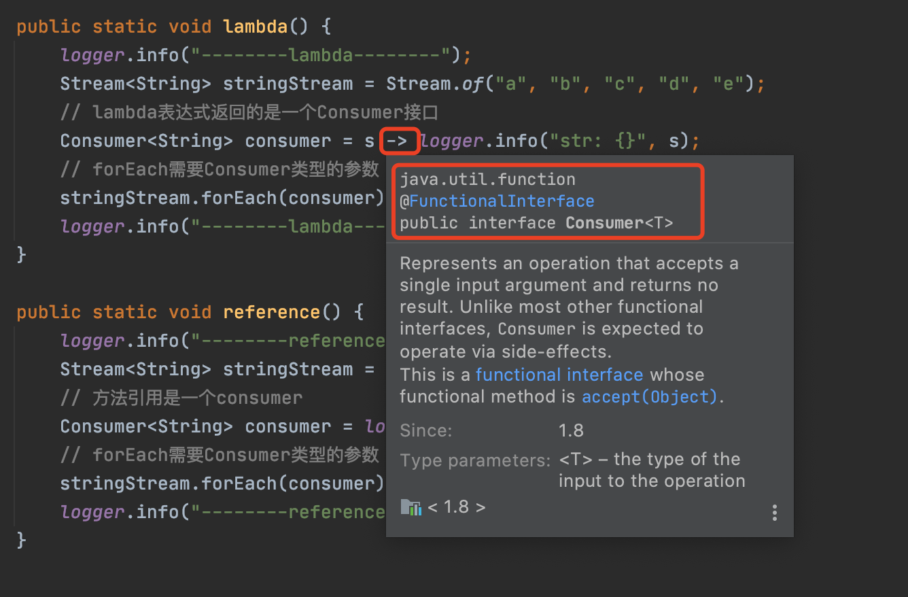
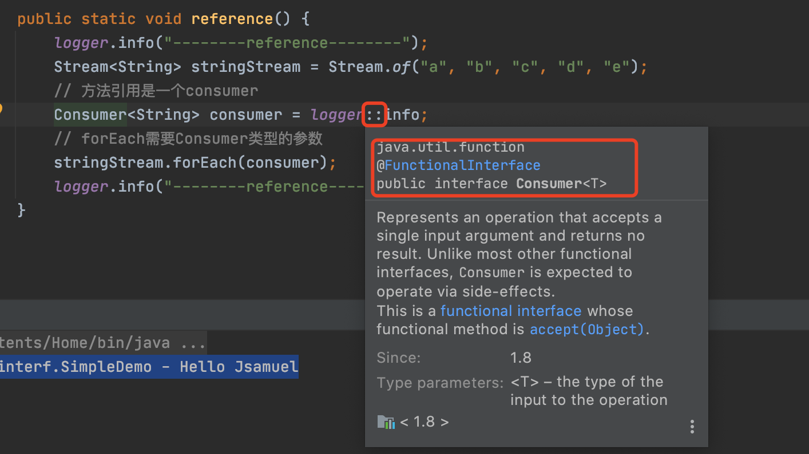
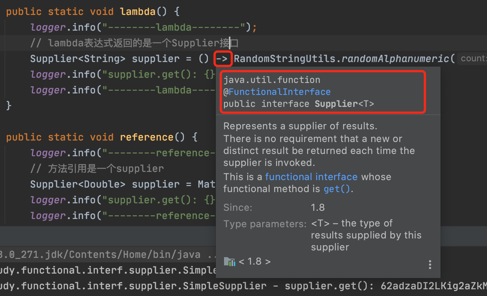
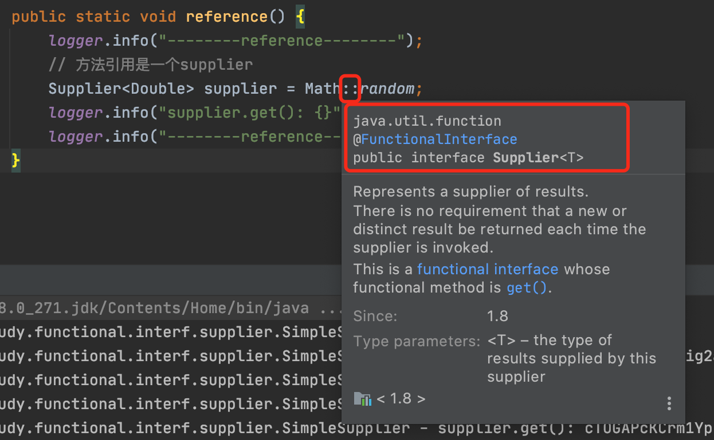

[toc]


# Consumer（消费型）

消费型接口，接口方法是accept。

只需要实现accept方法，就可以作为消费者输出信息。


## 实现Consumer的方法

### 1. 实现接口方法

直接创建一个Consumer接口，实现accept方法。

```java
public static void interf() {
    logger.info("--------interface--------");
    Stream<String> stringStream = Stream.of("a", "b", "c", "d", "e");
    // 实现consumer接口
    Consumer<String> consumer = new Consumer<String>() {
        @Override
        public void accept(String s) {
            logger.info("str: {}", s);
        }
    };
    // forEach需要Consumer类型的参数
    stringStream.forEach(consumer);
    logger.info("--------interface--------");
}
```


### 2. lambda表达式

lambda表达式返回值就是一个Consumer。



```java
public static void lambda() {
    logger.info("--------lambda--------");
    Stream<String> stringStream = Stream.of("a", "b", "c", "d", "e");
    // lambda表达式返回的是一个Consumer接口
    Consumer<String> consumer = s -> logger.info("str: {}", s);
    // forEach需要Consumer类型的参数
    stringStream.forEach(consumer);
    logger.info("--------lambda--------");
}
```


### 3. 方法引用

方法引用是一个Consumer。



```java
public static void reference() {
    logger.info("--------reference--------");
    Stream<String> stringStream = Stream.of("a", "b", "c", "d", "e");
    // 方法引用是一个consumer
    Consumer<String> consumer = logger::info;
    // forEach需要Consumer类型的参数
    stringStream.forEach(consumer);
    logger.info("--------reference--------");
}
```


输出

```
03:15:42.998 [main] INFO com.jsamuel.study.functional.interf.consumer.SimpleConsumer - --------interface/lambda/reference--------
03:15:43.004 [main] INFO com.jsamuel.study.functional.interf.consumer.SimpleConsumer - str: a
03:15:43.005 [main] INFO com.jsamuel.study.functional.interf.consumer.SimpleConsumer - str: b
03:15:43.005 [main] INFO com.jsamuel.study.functional.interf.consumer.SimpleConsumer - str: c
03:15:43.005 [main] INFO com.jsamuel.study.functional.interf.consumer.SimpleConsumer - str: d
03:15:43.005 [main] INFO com.jsamuel.study.functional.interf.consumer.SimpleConsumer - str: e
03:15:43.005 [main] INFO com.jsamuel.study.functional.interf.consumer.SimpleConsumer - --------interface/lambda/reference--------
```


## 其他Consumer接口

IntConsumer

DoubleConsumer

LongConsumer

BiConsumer

...


# Supplier（供给型）

供给型接口，相当于容器，可以用于存储数据，供其他方法使用数据，接口方法是get，无参数，返回一个值。

只需要实现get方法，就可以作为提供者提供信息。


## 实现Supplier的方法

### 1. 实现接口方法

直接创建一个Supplier接口，实现get方法。

get方法无参数，返回一个值。

每次使用这个接口都会返回一个值，并且保存在接口中，所以可以当做容器使用。

```java
public static void interf() {
    logger.info("--------interface--------");
    Supplier<String> supplier = new Supplier<String>() {
        @Override
        public String get() {
            return RandomStringUtils.randomAlphanumeric(20);
        }
    };
    logger.info("supplier.get(): {}", supplier.get());
    logger.info("--------interface--------");
}
```


### 2. lambda表达式

lambda表达式返回值就是一个Supplier。



```java
public static void lambda() {
    logger.info("--------lambda--------");
    // lambda表达式返回的是一个Supplier接口
    Supplier<String> supplier = () -> RandomStringUtils.randomAlphanumeric(20);
    logger.info("supplier.get(): {}", supplier.get());
    logger.info("--------lambda--------");
}
```


### 3. 方法引用

方法引用是一个Supplier。



```java
public static void reference() {
    logger.info("--------reference--------");
    // 方法引用是一个supplier
    Supplier<Double> supplier = Math::random;
    logger.info("supplier.get(): {}", supplier.get());
    logger.info("--------reference--------");
}
```


输出

```
03:42:52.482 [main] INFO com.jsamuel.study.functional.interf.supplier.SimpleSupplier - --------interface/lambda/reference--------
03:42:52.486 [main] INFO com.jsamuel.study.functional.interf.supplier.SimpleSupplier - supplier.get(): 62adzaDI2LKig2aZkMGU
03:42:52.487 [main] INFO com.jsamuel.study.functional.interf.supplier.SimpleSupplier - --------interface/lambda/reference--------
```


## 其他实例

Optional的orElseGet方法，需要Supplier参数

```java
public static void optional() {
    Stream<Integer> stream = Stream.of(1, 2, 3, 4, 5);
    Stream<Integer> filterStream = stream.filter(i -> i > 3);
    Optional<Integer> first = filterStream.findFirst();

    // orElse: first中存在，返回；不存在，返回括号中传入数据
    logger.info("first: {}", first.orElse(1));
    logger.info("first: {}", first.orElse(5));

    // supplier
    Supplier<Integer> supplier = () -> new Random().nextInt();

    // orElseGet: first中存在，返回；不存在，返回supplier返回的值
    logger.info("first: {}", first.orElseGet(supplier));

}
```


## 其他Supplier接口

IntSupplier

DoubleSupplier

LongSupplier

BooleanSupplier

...


# Predicate（谓词性）


# Function（功能型）


# 参考文档

https://cloud.tencent.com/developer/article/1488128