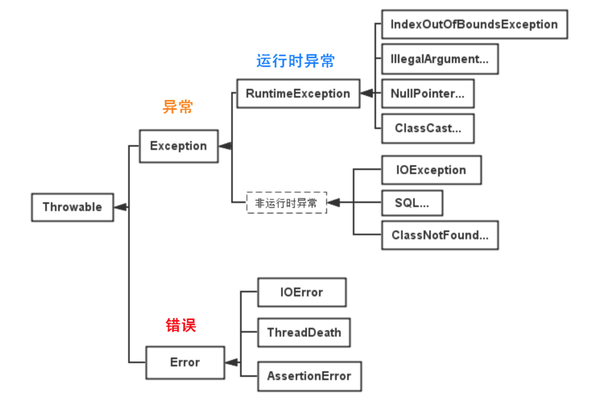
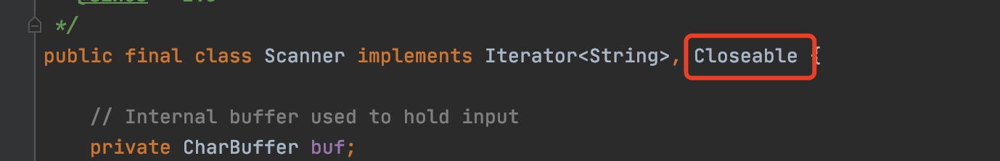
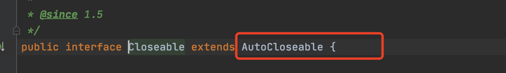

[toc]

# 异常层次结构

Java异常都是对象，是Throwable子类的实例。



## Throwable

所有错误与异常的超类。

包含两个子类：Error（错误）和Exception（异常）

提供了printStackTrace()等接口，用于获取堆栈跟踪数据等信息


## Error（错误）

Error及其子类：程序中无法处理的错误

此类错误一般表示代码运行时 JVM 出现问题：

- Virtual MachineError（虚拟机运行错误）
- NoClassDefFoundError（类定义错误）
- OutOfMemoryError：内存不足错误
- StackOverflowError：栈溢出错误

此类错误发生时，JVM 将终止线程。

这些错误是不受检异常，非代码性错误。


## Exception（异常）

程序本身可以捕获并且可以处理的异常。

Exception 这种异常又分为两类：运行时异常和编译时异常。


### 运行时异常

RuntimeException类及其子类异常，比如NullPointerException(空指针异常)、IndexOutOfBoundsException(下标越界异常)等。

这类异常是不检查异常，程序中可以选择捕获处理，也可以不处理。

运行时异常的特点是Java编译器不会检查他，没有try-catch和throws，也会编译通过。


### 非运行时异常（编译异常）

RuntimeException以外的异常，类型上都属于Exception类及其子类。

必须进行处理的异常，如果不处理，程序就不能编译通过。

如IOException、SQLException等以及用户自定义的Exception异常，一般情况下不自定义检查异常。


## 可查的异常（checked exceptions）

编译器要求必须处置的异常。

除了RuntimeException及其子类以外，其他的Exception类及其子类都属于可查异常。

当程序中可能出现这类异常，需要用try-catch语句捕获它，或者用throws子句声明抛出它，否则编译不会通过。


## 不可查的异常（unchecked exceptions）

编译器不要求强制处置的异常。

包括运行时异常（RuntimeException与其子类）和错误（Error）。


# 异常基础


## 关键字

- try：用于监听
- catch：用于捕获异常
- finally：总是会被执行。用于回收在try块里打开的物理资源，比如数据库连接，网络连接，磁盘文件等等。finally执行完成之后，才会回来执行try或者catch中的return或者throw语句。
- throw：用于抛出异常
- throws：用在方法签名中，用于声明该方法可能抛出的异常


## 异常的声明（throws）

若方法中存在检查异常，且不对其进行捕获，那么必须在方法投中显示声明该异常，告知调用者此方法有异常，需要进行处理。

声明多个异常，用逗号分割。

```java
public static void method() throws IOException, FileNotFoundException{
    //something statements
}
```


捕获知道如何处理的异常，不知道如何处理的异常继续传递下去。


规则：

- 不可查异常，即Error，RuntimeException或他们的子类，可以不使用throws关键字声明要抛出的异常，编译仍然可以通过，但在运行时系统会抛出
- 必须声明方法可以抛出的任何可检查异常。如果一个方法有可检查异常，要么用try-catch进行捕获处理，要么用throws声明抛出异常，否则会编译错误
- 只有抛出了异常的时候，方法的调用者才必须处理或者继续抛出该异常，对于不知道如何处理的异常，应该继续抛出，不要随便处理
- 若覆盖一个方法，不能声明与覆盖方法不同的异常；声明的异常必须是被覆盖方法所声明异常的同类或子类


## 异常的抛出（throw）

如果代码会引发某种个错误，可以创建一个合适的异常类实例并且抛出。

```java
public static double method(int value) {    
  	if(value == 0) {        
      	throw new ArithmeticException("参数不能为0"); //抛出一个运行时异常    
    }    
  	return 5.0 / value; 
}
```


在catch中抛出一个异常，一般是为了改变异常类型。


## 异常的自定义

定义一个异常类应该包含两个构造函数

- 一个无参构造函数
- 一个带有详细描述信息的构造函数


```java
public class MyException extends Exception {

    public MyException() {

    }

    public MyException(String msg) {
        super(msg);
    }
}
```

Throwable的toString方法会打印详细信息，可以用于调试。


## 异常的捕获


### try-catch

可以用多个catch捕获多个异常类型，针对不同的异常类型做出不同的处理

```java
public static void readFile(String filePath) {
    try {
        File file = new File(filePath);
        FileInputStream fileInputStream = new FileInputStream(file);
        InputStreamReader inputStreamReader = new InputStreamReader(fileInputStream);
        BufferedReader bufferedReader = new BufferedReader(inputStreamReader);
        // ...
    } catch (FileNotFoundException e) {

    } catch (IOException e) {

    }
}
```


可以同一个catch捕获多种异常，用竖线分割符`|`隔开，一起处理

```java
public static void readFileCommon(String filePath) {
    try {
        File file = new File(filePath);
        FileInputStream fileInputStream = new FileInputStream(file);
        InputStreamReader inputStreamReader = new InputStreamReader(fileInputStream);
        BufferedReader bufferedReader = new BufferedReader(inputStreamReader);
        // ...
    } catch (FileNotFoundException | NullPointerException e) {

    } catch (IOException e) {

    }
}
```


FileNotFoundException是IOException的子类。


### try-catch-finally

```java
public static void example() {
    try {
        // 执行程序代码，可能会出现异常
    } catch (Exception e) {
        // 捕获异常并处理
    } finally {
        // 必执行的代码
    }
}
```


执行顺序

- try没有捕获到异常：try - finally - finally之后的
- try捕获到异常，catch没有处理：try - finally；此异常抛给JVM处理
- try捕获到异常，catch有处理：try - catch - finally -  finally之后的


```java
private static void readFile(String filePath) throws MyException {
  	logger.info("readFile start!");

  	File file = new File(filePath);
  	String result;
  	BufferedReader reader = null;

  	try {
    		reader = new BufferedReader(new FileReader(file));
    		while ((result = reader.readLine()) != null) {
      			logger.info(result);
    		}
  	} catch (FileNotFoundException e) {
    		logger.error("readFile failed, ", e);
    		MyException ex = new MyException("readFile failed");
    		ex.initCause(e);
    		throw ex;
  	} catch (IOException e) {
    		logger.error("readFile failed, ", e);
    		MyException ex = new MyException("readFile failed");
    		ex.initCause(e);
    		throw ex;
  	} finally {
    		logger.info("readFile end!");
    		if (null != reader) {
      			try {
        				reader.close();
      			} catch (IOException e) {
        				logger.error("close reader failed, ", e);
      			}
    		}
  	}
}
```


### try-finally

主要用于保证资源在使用后被正确关闭。

比如IO流关闭，Lock对象释放锁，数据库连接关闭等等。


### try-with-resource

在finally中执行的close方法，也可能会抛出异常，从而覆盖了原始的异常信息。

自动释放的资源需要是实现了 AutoCloseable 接口的类。


```java
public static void example(String filePath) {
    try (Scanner scanner = new Scanner(new FileInputStream(filePath), "UTF-8")) {

    } catch (IOException e) {

    }
}
```








try代码退出时，会自动调用scanner的close方法。

和把scanner方法放在finally中不同的是，如果scanner.close抛出异常，会被抑制，抛出的仍然是原始异常。

被抑制的异常会由addSuppressed方法添加到原来的异常中，如果想要获取，可以通过方法getSuppressed方法获取。


## 常用的异常


- RuntimeException

- IOException
- 其他


# 异常实践


## 不正常的情况才使用异常


比如，在解析字符串形式的数字时，可能存在数字格式错误，或者出现空指针异常，不得通过catch Exception来进行处理。


## 在finally块中清理资源或者使用try-with-resource语句


不要把清理资源的代码放到try块最后，应该放在finally中，保证一定执行。


如果资源实现了AutoCloseable接口，可以使用try-with-resource。

```java
public static void automaticallyCloseResource(String filePath) {
    File file = new File("");
    try (FileInputStream fileInputStream = new FileInputStream(file)) {

    } catch (FileNotFoundException e) {

    } catch (IOException e) {
        
    }

}
```

当你在 try 子句中打开资源，资源会在 try 代码块执行后或异常处理后自动关闭。


## 使用标准的异常

常用标准异常：

- IllegalArgumentException: 参数值不合适
- IllegalStateException: 参数状态不合适
- NullPointerException: 在null被禁止的情况下参数值为null
- IndexOutOfBoundsExceptions: 下标越界
- ConcurrentModificationException: 在禁止并发修改的情况下，对象检测到并发修改
- UnsupportedOperationException: 对象不支持客户请求的方法


## 对异常增加文档说明

可以在Javadoc添加@throws声明，并且描述抛出异常的场景。

```java
/**
* Method description
* 
* @throws MyBusinessException - businuess exception description */ 
public void doSomething(String input) throws MyBusinessException {   
  // ... 
}
```


## 优先捕获最具体的异常


只有匹配异常的第一个catch块会被执行，所以要优先捕获最具体的异常，也就是子类。

不太具体的catch块添加到列表的末尾。


## 不要捕获Throwable类

Throwable是所有异常和错误的超类。

- 不应该由应用程序处理错误
- 没有细分，无法分辨，没有意义


## 不要忽略异常

catch之后不要没有做任何异常处理。

合理的做法是：

- 处理异常
- 至少要记录异常信息：`log.error("...", e);`


## 不要记录并抛出异常


这个行为会导致一个异常输出多条日志。


如果想提供更加有用的异常处理信息，可以包装成自定义异常，增加异常信息用于定位。


## 包装异常时不要抛弃原始异常


在将原始异常包装为自定义异常时，请确保将原始异常设置为原因。

否则会丢失堆栈跟踪和原始异常的消息，导致异常分析和问题定位变得困难。

```java
throw new MyException("readFile failed", e);

public MyException(String msg, Throwable cause) {
  	super(msg, cause);
}
```


## 不要使用异常控制程序的流程

比如把异常当做if使用。

不可以！


## 不要在finally块中使用return

执行顺序是：try-return -> finally

如果此时在finally中存在return语句，就会直接返回，把try中的return直接丢弃了。


