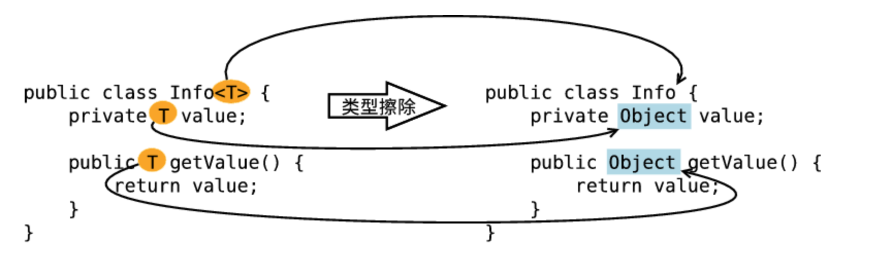
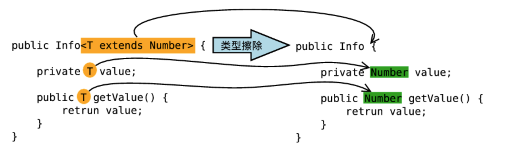
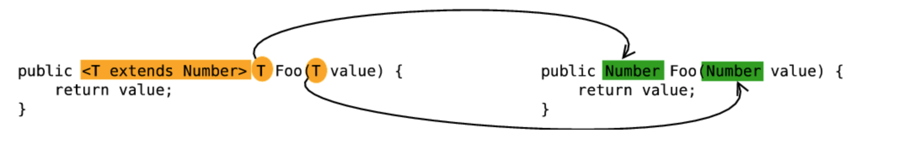

[toc]


Java实际上是`伪泛型`。

在Java语法中支持泛型，但在编译阶段会进行`类型擦除`，将所有的泛型表示（尖括号中的内容），都替换成具体的类型（其对应的原生态类型），仿佛完全没有泛型一样。


# 为什么需要泛型

> 泛型的本质是为了参数化类型。
>
> 在泛型使用过程中，操作的数据类型被指定为一个参数，这种参数可以用在类、接口和方法中，分别被称为泛型类，泛型接口，泛型方法。


使用泛型的意义：适用于多种数据类型执行相同的代码，即代码复用。


使用泛型的好处：

- 使用Object：无法约束类型，使用时需要进行强制类型转换，容易出现`ClassCastException`
- 泛型：提供类型的约束，提供编译前的检查；泛型中的类型在使用时指定，不需要强制类型转换，是`类型安全`的，编译器会`检查类型`


# 泛型的基本使用


## 泛型类


简单的泛型类

```java
// T, type的简称，也可以写成其他的标识符
public class Point<T> {

    // var的类型由T指定，即由外部指定
    private T var;

    // 返回值的类型，由外部决定
    public T getVar() {
        return var;
    }

    // 设置值的类型，由外部决定
    public void setVar(T var) {
        this.var = var;
    }
}
```


测试代码

```java
@Test
public void testPoint() {
    Point<String> pointStr = new Point<String>();
    pointStr.setVar("test point str");
    logger.info("length: {}", pointStr.getVar().length());
}
```


输出

```
21:26:09.020 [main] INFO com.jsamuel.study.generic.GenericTest - length: 14
```


多元泛型类

```java
// 指定了两个泛型类型
@Getter
@Setter
public class NotePad<K, V> {

    // 变量类型由外部决定
    private K key;

    // 变量类型由外部决定
    private V value;

}
```


测试代码

```java
@Test
public void testNotePad() {
    NotePad<String, Integer> notePad = new NotePad<String, Integer>();
    notePad.setKey("tom");
    notePad.setValue(20);
    logger.info("name: {}, old: {}", notePad.getKey(), notePad.getValue());

}
```


输出

```
21:29:16.418 [main] INFO com.jsamuel.study.generic.GenericTest - name: tom, old: 20
```


## 泛型接口


接口类

```java
// 在接口上定义泛型
public interface Info<T> {

    // 定义抽象方法，抽象方法的返回值是泛型类型
    public T getVar();
}
```


子实现类

```java
// 定义泛型接口的子类
public class InfoImpl<T> implements Info<T> {

    // 定义属性
    private T var;

    public InfoImpl(T var) {
        this.var = var;
    }

    public void setVar(T var) {
        this.var = var;
    }

    public T getVar() {
        return var;
    }
    
}
```


测试代码

```java
@Test
public void testInfo() {
    // 声明接口类型，通过子类实例化对象
    Info<String> info = new InfoImpl<String>("tom");
    logger.info("name: {}", info.getVar());
}
```


输出

```
21:29:16.413 [main] INFO com.jsamuel.study.generic.GenericTest - name: tom
```


## 泛型方法

泛型方法，在调用方法是，指明泛型的具体类型


### 定义泛型方法的语法格式

```java
/**
     * 泛型方法
     * 
     * @param c 用来创建泛型对象
     * @param <T> 声明一个泛型T
     * @return
     * @throws InstantiationException
     * @throws IllegalAccessException
     */
    public <T> T getObject(Class<T> c) throws InstantiationException, IllegalAccessException {
        // 创建泛型对象
        T t = c.newInstance();
        return t;
    }
```


`<T>`：声明此方法持有一个类型T，也可以理解为声明此方法为泛型方法

`T`：指明该方法的返回值的类型，为类型T

`Class<T>`：指明泛型T的具体类型

`c`：用来创建泛型T代表的类的对象

`c.newInstance()`：创建泛型对象


### 调用泛型方法的语法格式

```java
public void testGeneric() throws ClassNotFoundException, IllegalAccessException, InstantiationException {
    Generic generic = new Generic();
    // 调用泛型方法
    // obj，User类的实例
    // 利用Class.forName，指定泛型的具体类型
    Object obj = generic.getObject(Class.forName("com.jsamuel.study.generic.gclass.Point"));
}
```


注意:

- 定义泛型方法，必须在返回值前加一个`<T>`，用于声明这是一个泛型方法
- `Class<T>`，指明泛型的具体类型
- `c`：用来创建泛型类的对象
  - 我们不知道具体的类型，不能new
  - 利用反射创建对象，即newInstance()


为什么要用泛型方法：

- 泛型类不够灵活：在实例化时需要指明类型，换一个类型需要重新new
- 泛型方法更加灵活：在调用时再指明类型


## 泛型的上下限

为了解决泛型中隐含的转换问题，Java泛型加入了类型参数的上下边界机制。


`<? extends A>`，表示该类型参数可以是A（上边界）或者A的子类类型。

编译时擦除到类型A，即用A类型代替类型参数。


这种方式可以解决以下问题

```java
class A {
  
}

class B extends A {
  
}

// funA&funB，不会报错
public static void funA (A a) {
  
}

public static void funB (B b) {
    fundA(b);
}

// funC不会报错，funD会报错
public static void funC (List<A> list) {
  
}

public static void funD (List<B> list) {
    fundC(list);
}

// funE&funF不会报错
public static void funE (List<? extends A> list) {
  
}

public static void funF (List<B> list) {
    funE(list);
}
```


编译器知道类型参数的范围，如果传入的实例类型B在这个范围内的话，就允许转换，这时只需要一次类型转换就可以，运行时会把对象当做A的实例看待。


使用泛型，我们可以为传入的泛型类型实参，进行上下边界的限制。

比如：类型实参只准传入某种类型的父类或者某种类型的子类。


### 上限

```java
// 限制泛型只能是数字类型
@Getter
@Setter
@ToString
public class Up<T extends Number> {

    private T var;

}
```


测试

```java
@Test
public void testUp() {
    // 声明Integer的泛型对象
    Up<Integer> up = new Up<Integer>();
    up.setVar(10);
    logger.info("up: {}", up.toString());
}
```


输出

```
22:12:28.741 [main] INFO com.jsamuel.study.generic.GenericTest - up: Up(var=10)
```


### 下限

```java
@Getter
@Setter
@ToString
public class Down<T> {

    private T var;
}
```


测试

```java
@Test
public void testDown() {
    Down<String> down1 = new Down<String>();
    down1.setVar("down1");
    fun(down1);

    Down<Object> down2 = new Down<Object>();
    down2.setVar(new Object());
    fun(down2);
}

// 只能接收String或者Object类型的泛型，String类的父类只有Object类
private static void fun(Down<? super String> temp) {
    logger.info("down: {}", temp);
}
```


输出

```
22:12:50.240 [main] INFO com.jsamuel.study.generic.GenericTest - down: Down(var=down1)
22:12:50.244 [main] INFO com.jsamuel.study.generic.GenericTest - down: Down(var=java.lang.Object@5b1d2887)
```


### 总结

使用方式

- `<?>`：无限制通配符

- `<? extends E>`：extends关键字声明了类型的上界，表示参数化的类型可能是所指定的类型，或者是此类型的子类

- `<? super E>`：super关键字声明了类型的下界，表示参数化的类型可能是指定的类型，或者是此类型的父类


使用场景

- 参数化类型表示一个T的生产者，使用`<? extends E>`，即生产者有上限
- 参数化类型表示一个T的消费者，使用`<? super E>`，即消费者有下限
- 即是生产者也是消费者，通配符没有意义，需要精确的参数类型


示例

```java
public class UpAndDown {

    // 类型参数E的范围是 <E extends Comparable<? super E>>
    // 1. 需要进行比较，所以E需要是可比较的类，所以需要E extends Comparable<>
    // 2. Comparable<? super E>，要对E进行比较，即E的消费者，所以需要用super
    // 3. 参数 List<? extends E>，表示要操作的数据是E的子类的列表，指定上限，这样容器才够大
    public <E extends Comparable<? super E>> E max(List<? extends E> e1) {
        if (e1 == null) {
            return null;
        }

        // 迭代器返回的元素，属于E的某个子类型
        Iterator<? extends E> iterator = e1.iterator();
        E result = iterator.next();
        while (iterator.hasNext()) {
            E next = iterator.next();
            if (next.compareTo(result) > 0) {
                result = next;
            }
        }

        return result;
    }
}
```


多个限制使用&符号

`<T extends Staff & Passenger>`

```java
public class Multiple {

    private static Logger logger = LoggerFactory.getLogger(Multiple.class);

    public static <T extends Staff & Passenger> void discount(T t) {
        if (t.getSalary() < 2500 && t.isStanding()) {
            logger.info("congratulation!");
        }
    }

    public static void main(String[] args) {
        discount(new Me());
    }
}
```

  

# 深入理解


## 类型擦除


### 泛型的类型擦除原则

- 消除类型参数声明，即删除<>及其包围的部分
- 根据类型参数的上下界推断并替换所有的类型参数为原生态类型：
  - 类型参数是无限制通配符或者没有上下界限，替换为Object
  - 存在上界限，根据子类替换原则，取类型参数的最左边限定类型，即父类
- 为了保证类型安全，必要时插入强制类型转换代码
- 自动产生桥接方法，保证擦除类型后的代码仍然具有泛型的多态性


### 如何擦除

1. 擦除类定义中的类型参数 - 无限制类型擦除

类定义中的类型参数，没有任何限制时，在类型擦除中直接被替换成Object，即`<T>`和`<?>`的类型参数都被替换成Object




2. 擦除类定义中的类型参数 - 有限制类型擦除

类定义中的类型参数存在限制（上下界）时，在类型擦除中替换为类型参数的上界或者下界

`<T extends Number>`和`<? extends Number>`的类型参数被替换为`Number`，`<? super Number>`被替换为Object




3. 擦除方法定义中的类型参数

擦除方法定义中的类型参数原则和擦除类定义中的类型参数是一样的，这里仅以擦除方法定义中的有限制类型参数为例




### 证明类型的擦除的方式

1. 判断原始类型是否相等

   测试类

   ```java
   public static void testErase1() {
       // 验证原始类型相等
   
       ArrayList<String> strList = new ArrayList<String>();
       strList.add("123");
   
       ArrayList<Integer> intList = new ArrayList<Integer>();
       intList.add(123);
   
       logger.info("class compare result: {}", strList.getClass() == intList.getClass());
   }
   ```

   

   输出

   ```
   02:11:53.352 [main] INFO com.jsamuel.study.generic.Erase.Erase - class compare result: true
   ```

   

   一个是`ArrayList<String>`泛型类型的，只能存储字符串；一个是`ArrayList<Integer>`泛型类型的，只能存储整数。

   通过list1对象和list2对象的`getClass()`方法获取他们的类的信息，最后发现结果为true。

   说明泛型类型String和Integer都被擦除掉了，只剩下原始类型。


2. 通过反射添加其他类型元素

   测试代码

   ```java
   public static void testErase2() {
       // 通过反射添加其他类型元素
   
       ArrayList<Integer> intList = new ArrayList<Integer>();
       intList.add(1);
   
       try {
           intList.getClass().getMethod("add", Object.class).invoke(intList, "asdfg");
       } catch (NoSuchMethodException | InvocationTargetException | IllegalAccessException e){
           logger.error(e.getMessage());
       }
   
       for (int i = 0; i < intList.size(); i++) {
           logger.info("list {}: {}", i, intList.get(i));
       }
   }
   ```

   

   输出

   ```
   02:11:53.357 [main] INFO com.jsamuel.study.generic.Erase.Erase - list 0: 1
   02:11:53.358 [main] INFO com.jsamuel.study.generic.Erase.Erase - list 1: asdfg
   ```

   

   定义了一个`ArrayList`泛型类型实例化为`Integer`对象。

   直接调用`add()`方法，那么只能存储整数数据；当利用反射调用`add()`方法的时候，却可以存储字符串。

   说明了`Integer`泛型实例在编译之后被擦除掉了，只保留了原始类型


## 类型擦除后保留的原始类型


**原始类型**：擦除去了泛型信息，最后在字节码中的类型变量的真正类型。

无论何时定义一个泛型，相应的原始类型都会被自动提供，类型变量擦除，并使用其限定类型（无限定的变量用Object）替换。


注意要区分原始类型和泛型变量的类型。


调用泛型方法时，可以指定泛型，也可以不指定

- 不指定泛型：泛型变量的类型为该方法中的几种类型的同一父类的最小级，一直到Object
- 指定泛型：该方法的几种类型，必须是该泛型的实例的类型，或者其子类


测试代码

```java
public static void testCallGeneric() {
    // 不指定泛型
    // 两个参数都是Integer，所以T是Integer
    int i = add(1, 2);
    // 一个是Integer，一个是Float，取同一父类的最小级，Number
    Number f = add(1, 1.2);
    // 一个是Integer，一个是String，取同一父类的最小级，Object
    Object o = add(1, "123");
    logger.info("i: {}, f: {}, o: {}", i, f, o);

    // 指定泛型
    // 指定Integer，所以只能为Integer类型或者其子类
    int a = CallGeneric.<Integer>add(1, 2);
    // 编译错误，指定了Integer，不能有Float
    // int b = GenericTest.<Integer>add(1, 1.2);
    // 指定为Number，可以为Number的子类，Integer和Float都支持
    Number c = CallGeneric.<Number>add(1, 1.2);
    // 编译错误，指定了Integer，不能有String
    // int d = GenericTest.<Integer>add(1, "123");
    // 指定为Object，可以为Object的子类，Integer和String都支持
    Object e = CallGeneric.<Object>add(1, "123");
    logger.info("a: {}, c: {}, e: {}", a, c, e);
}

public static <T> T add(T x, T y) {
    return y;
}
```


输出

```
02:34:37.441 [main] INFO com.jsamuel.study.generic.CallGeneric - i: 2, f: 1.2, o: 123
02:34:37.447 [main] INFO com.jsamuel.study.generic.CallGeneric - a: 2, c: 1.2, e: 123
```


在泛型类中也可以不指定泛型类型，这时泛型为Object。

比如ArrayList，不指定泛型类型，可以存储任意对象。

```java
ArrayList list = new ArrayList();  
list.add(1);  
list.add("121");  
list.add(new Date());  
```

