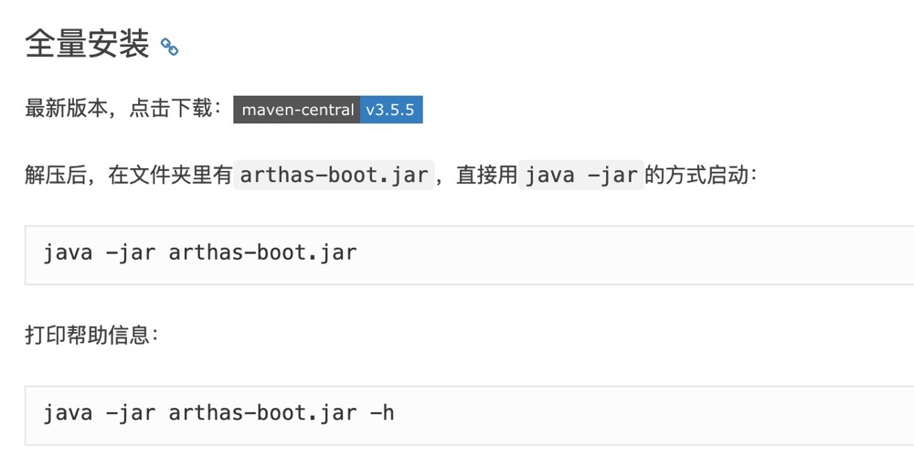
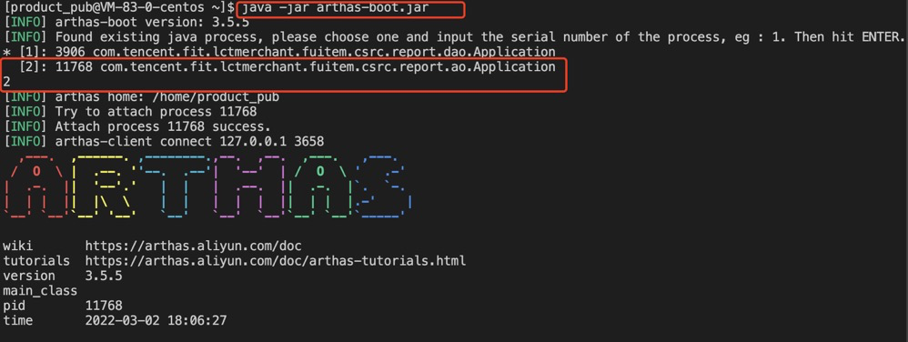
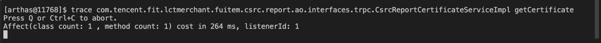
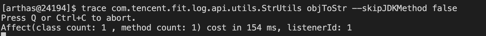
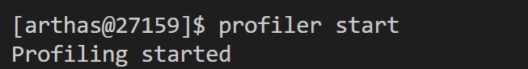
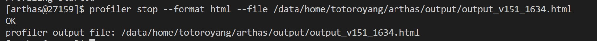
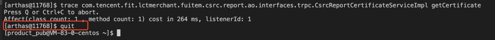
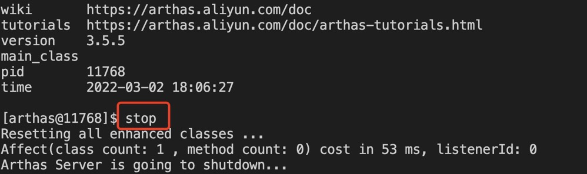

[toc]

官方文档：https://arthas.aliyun.com/doc/


# 安装

https://arthas.aliyun.com/doc/install-detail.html


## 下载




## 解压

unzip arthas-packaging-3.5.5-bin.zip


# 启动

https://arthas.aliyun.com/doc/quick-start.html

https://arthas.aliyun.com/doc/manual-install.html


## 启动命令

默认端口启动，3568

```xml
java -jar arthas-boot.jar
```


指定端口启动rthas

```shell
java -jar arthas-boot.jar  --telnet-port 3659 --http-port -1
```


## 查看需要监控的进程id

```shell
ps -aux | grep $service
```


## 选择进程ID

1/2/3/...




# trace监控


## trace命令

trace $class $method

例子：

```shell
trace com.tencent.fit.lctmerchant.fuitem.csrc.report.ao.interfaces.trpc.CsrcReportCertificateServiceImpl getCertificate
```

注意：class为带上包名的class




## 包含jdk的函数

```
--skipJDKMethod <value>  skip jdk method trace, default value true.
```

默认情况下，trace不会包含jdk里的函数调用，如果希望trace jdk里的函数，需要显式设置`--skipJDKMethod false`




## 根据调用耗时过滤

```shell
trace demo.MathGame run '#cost > 10'
```

单位ms，只会展示耗时大于10ms的调用路径，有助于在排查问题的时候，只关注异常情况


## trace多个类&方法

使用竖线分隔符

```shell
trace -E com.tencent.trpc.filter.fbp.FbpProviderFilter|com.tencent.trpc.filter.fbp.utils.LogUtils|com.tencent.trpc.filter.fbp.utils.Utils|com.tencent.trpc.proto.fbp.common.FbpServerCodec filter|getMdc|getLogConfig|getRequestInfo|getResponseInfo|getReqMsg|getProviderProtocol|getCustomReqMsg|getRetFromT|getMsgNoFromRequest|getLogConfig|getStatInfo|getDstServerInServer|getServerExt|getRetFromRequest|getMsgNoFromResponse|getCalleeRetFromResponse|pbToJson|decode|getStatInfo|setRouteTag --skipJDKMethod false

trace -E com.tencent.trpc.filter.fbp.FbpConsumerFilter|com.tencent.trpc.filter.fbp.utils.LogUtils|com.tencent.trpc.filter.fbp.utils.Utils|com.tencent.trpc.proto.fbp.common.FbpClientCodec filter|getMdc|getLogConfig|getRequestInfo|getResponseInfo|getReqMsg|getConsumerProtocol|getRetFromT|getMsgNoFromRequest|getMsgNoFromResponse|getCallerRetFromResponse|pbToJson|decode|parseBackendErrors|transErrorCode --skipJDKMethod false

trace -E com.tencent.trpc.transport.netty.NettyCodecAdapter|com.tencent.trpc.transport.netty.NettyClientHandler|com.tencent.trpc.proto.support.DefRpcClient|com.tencent.trpc.proto.fbp.common.FbpClientCodec decode|channelRead|received|received|process|handler|decodeResponseBody  --skipJDKMethod false
```


# 火焰图

https://arthas.aliyun.com/doc/profiler.html


## 启动profiler

`profiler start`

默认是cpu性能分析




## 查看profiler状态

`profiler status`


## 停止profiler

```shell
profiler stop --format html --file /data/home/totoroyang/arthas/output/output_v130_1427.html
```




默认情况下，结果文件是`html`格式，也可以用`--format`参数指定

或者在`--file`参数里用文件名指名格式。比如`--file /tmp/result.html`


# 监控

monitor，非实时返回命令

```
monitor -c 5 com.tencent.trpc.filter.fbp.FbpProviderFilter filter

monitor -c 5 com.tencent.trpc.proto.fbp.common.FbpServerCodec decode

monitor -c 5 com.tencent.trpc.filter.fbp.FbpConsumerFilter filter

monitor -c 5 com.tencent.trpc.proto.fbp.common.FbpClientCodec decode
```


## tt

方法执行数据的时空隧道，记录下指定方法每次调用的入参和返回信息，并能对这些不同的时间下调用进行观测

```
tt -t com.tencent.trpc.filter.fbp.FbpProviderFilter filter
tt -t com.tencent.trpc.proto.fbp.common.FbpServerCodec decode

tt -t com.tencent.trpc.core.transport.AbstractClientTransport createChannel

tt -t com.tencent.trpc.filter.fbp.FbpConsumerFilter filter
tt -t com.tencent.trpc.proto.fbp.common.FbpClientCodec decode
```


java -jar arthas-boot.jar  --telnet-port 3659 --http-port -1


## 其他文档

https://cloud.tencent.com/developer/article/1554194


# 退出

https://arthas.aliyun.com/doc/quick-start.html


## 退出当前连接

`quit/exit`




## 完全退出

`stop`




# 其他

https://arthas.aliyun.com/doc/options.html


# 问题

https://arthas.aliyun.com/doc/faq.html


## target process not responding or HotSpot VM not loaded

启动arthas和进程的要求为同一用户，否则会报错：

```
com.sun.tools.attach.AttachNotSupportedException: Unable to open socket file: target process not responding or HotSpot VM not loaded
```


切换用户命令

```shell
su product_pub
```

