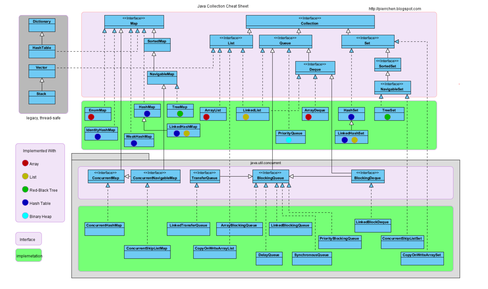

[toc]

容器中包含Collection和Map。

Collection存储对象的集合。

Map存储键值对的映射表。

# Collection

## Set

### HashSet

基于哈希表实现，支持快速查找，不支持有序性操作。

失去了元素的插入顺序信息，使用Iterator遍历，得到的结果是不确定的。

查找的时间复杂度O(1)

#### LikedHashSet

具有HashSet的查找效率，内部使用双向链表维护元素的插入顺序。

### TreeSet

基于红黑树实现，支持有序性操作。

查找效率比不上HashSet。

查找的时间复杂度O(logN)

## List

### ArrayList

`实现`

基于动态数组实现，支持随机访问。

`特性-自动扩容`

每个ArrayList都有一个容量，表示底层数组的实际大小，容器中存储的元素个数不能大于当前容量。

如果容量不足，容器会自动增大底层数组的大小，每次数组容量的增长大约是原来容量的1.5倍。

也可以手动增加容量，ensureCapacity。

自动扩容的操作代价很高，所以在使用时，我们尽量在构造时就指定容量，避免扩容的发生。

`顺序/乱序`

顺序容器，即元素存放的数据与放进去的顺序相同。

`常用方法`

- size，isEmpty，get，set：常数时间

- add，remove：时间开销和插入位置有关，允许放入null元素
  - `add(int index, E e)`，需要先对元素进行移动，然后完成插入操作，所以该方法有线性的时间复杂度
  - `remove(int index)`，需要删除后对元素进行移动，为了让GC起作用，必须显式的把最后一个位置赋值null

- addAll：时间开销和添加元素的个数成正比

  - `addAll(Collection<? extends E> c)`，末尾添加，只和添加元素的个数相关

  - `addAll(int index, Collection<? extends E> c)`，指定位置添加，和插入的位置&添加元素的个数相关

- trimToSize：将底层数组的容量，调整为当前列表保存的实际元素的个数

- indexOf，lastIndexOf

`并发`

没有实现同步。

多个线程并发访问，需要手动同步，或者使用Vector。

`Fail-Fast机制`

通过记录ModCount参数实现。

在面对并发的修改时，迭代器很快就会完全失败，而不是冒着在将来某个不确定时间发生任意不确定行为的风险。

https://juejin.cn/post/6879291161274482695

### LinkedList

`实现`

基于双向链表实现，只能顺序访问。

first引用，指向链表第一个元素。

last引用，指向链表最后一个元素。

没有哑元，当链表为空时，first和last都指向null。

`特点`

同时实现了List和Deque接口，即可以看做顺序容器，又可以看做队列（双向队列和队列），还可以看做栈。

不过需要栈或者队列时，首选还是ArrayDeque，他比LinkedList有更好的性能。

可以存放null元素。

`性能`

可以快速地在链表中插入和删除元素。

跟下标相关的操作：线性时间

首段/末尾删除元素：常数时间

LinkedList通过index检索数据，没有ArrayList效率高。

`并发`

没有实现同步。

如要多个线程并发访问，需要使用`Collections.synchronizedList()`方法对其进行包装。

`常用方法`

- getFirst，getLast
- remove
  - removeFirst
  - removeLast
  - remove(e): 删除跟指定元素相等的第一个元素
  - remove(index): 删除指定下标处的元素
- add
  - add(e): 在链表末尾插入元素，时间消耗是常数时间
  - add(index, e): 指定下标处插入元素，时间消耗是线性时间
- addAll(index, c)
- clear: 为了让GC更快地回收放置的元素
- get(index), set(index, e)
- indexOf(e): 查找第一次出现的index，找不到返回-1
- lastIndexOf(e)

### Vector

和ArrayList类似，但是是线程安全的。

## Queue

FIFO的单向队列。

`常用方法`

- peek：返回第一个元素，不移除；队列元素为空，返回null
- element：返回第一个元素，不移除；队列元素为空，抛出NoSuchElement异常
- poll：返回第一个元素，移除；队列元素为空，返回null
- remove：同上；队列元素为空，抛出NoSuchElement异常
- offer：在尾部加入元素，添加成功返回true；队列满，返回false
- add：在尾部加入元素，添加成功返回true；队列满，抛出异常

### PriorityQueue

基于堆结构实现，可用于实现优先队列。

也可以作为堆使用。

### BlockingQueue

#### ArrayBlockingQueue

#### LinkedBlockingQueue

#### PriorityBlockingQueue

#### DelayQueue

#### SynchronousQueue

### Deque

双向队列。

`常用方法`

- offerFirst：在头部插入元素
- offerLast：在尾部插入元素
- peekFirst：获取头部元素，不移除
- peekLast：获取尾部元素，不移除
- pollFirst：获取头部元素，移除
- pollLast：获取尾部元素，移除
- push：在头部插入元素，等同于addFirst，队列满会抛异常
- pop：获取头部元素，移除，等同于removeFirst，队列为空会抛异常

#### ArrayDeque

无初始容量的双端队列。

作为栈或者队列使用，栈的效率不如LinkedList。

#### LinkedList

双向链表，可用于实现双向队列。

作为栈或者队列使用，队列的效率不如ArrayDeque。

# Map

## HashMap

基于哈希表实现。

## TreeMap

基于红黑树实现

## LinkedHashMap

使用双向链表来维护元素的顺序。

顺序为插入顺序，或者是LRU（最近最少使用）。

## HashTable

和HashMap类似，但是是线程安全的。

待废弃，使用ConcurrentHashMap。

## EnumMap

## IdentityHashMap

## ConcurrentMap

### ConcurrentHashMap

线程安全。

效率高，使用分段锁。

## WeakHashMap

## SortedMap

